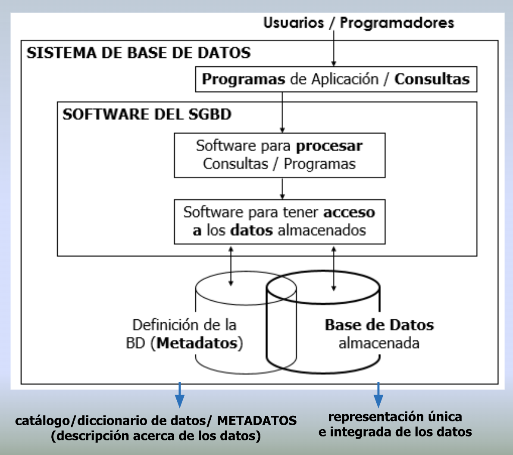
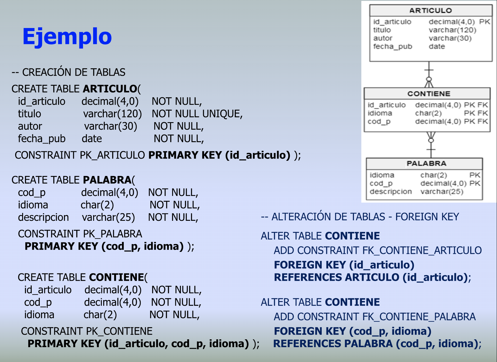
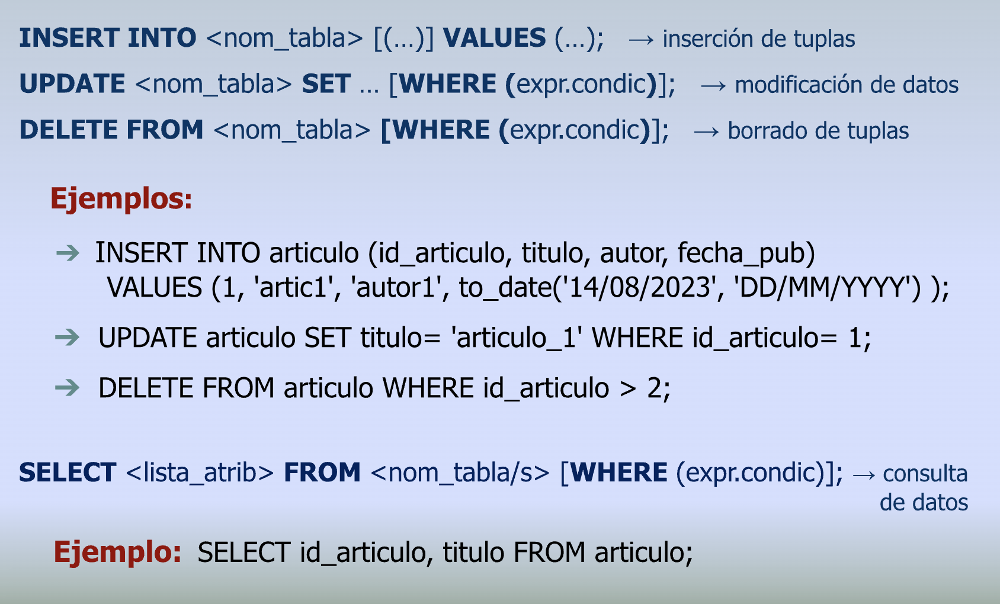

# Introducción

## Bases de datos (BD)

* La tecnología de BD es un componente esencial de casi todos los sistemas de información y está en continua evolución

  

* Sistemas de bancos, compras online, sistemas de salud, de reservas de vuelos, hoteles, bibliotecas, etc.
* BD Multimedia para almacenamiento y recuperación de imágenes, videos, etc.
* Sistemas de Información Geográfica (GIS)
* BD de gran capacidad, sistemas big data, BD No-SQL, BD para dispositivos móviles, etc.

## ¿Qué es una BD?

* **Conjunto de datos almacenados, representando entidades y sus relaciones, lógicamente coherente** (no hay contradicción entre los datos relacionados ni pérdida de información, aún ante uso compartido), **con significado implícito** (representa aspectos del universo de discurso "UdeD", Datos + contexto = Información) **y persistente** (los datos permanecen en el tiempo)
* **Una BD es diseñada, construida y poblada con datos para un cierto propósito**
* **Contiene información relevante para una organización** que es clave para la correcta toma de decisiones

## Evolución de los sistema de BD

| | |
| -- | -- |
| **Sistemas en red y jerárquicos** | años '60 se creó el primer sistema de red (IDS = Integrated Data Store). También sutgieron sistemas jeráquicos  (IMS = Information Management System, de IBM). Representación limitada de datos y acceso complejo |
| **Modelo relacional** | 1970: Codd propuso el MR, 1976: Chen presentó el MER, 1986: SQL |
| **MR extendido, OO**  | Mejoras sobre el MR puro y lenguajes de consulta. Extensión de capacidades, tipos de datos y aplicaciones |
| **Nuevas aplicaciones y prestaciones** | BD multimedia, GIS, warehouses, BD No-SQL, disp. móviles, ... |

## ¿Por qué surgen las BD?

* **Debilidades de los sistemas de gestión de archivos**
  * elementales para el tratamiento de datos y sus interrelaciones, posible redundancia por replicación de datos e inconsistencia, problemas de gestión de acceso y actualización simultánea, etc.
  * utilización mediante programas de aplicación demasiado compleja para garantizar la integridad de los datos
* **impulsaron el desarrollo de software de gestión de datos más sofisticado**

  

* Permite definir, almacenar y recuperar datos de la BD de manera eficiente
* Los **mismos datos** son compartidos por diferentes usuarios/aplicaciones

## Características de los SGBD

| Proveen capacidad y soporte para: | |
| -- | -- |
| **Control de redundancia** | en los datos y **evitan riesgo de inconsistencias** al compartir la información |
| **Consistencia e integridad de datos**| se define la validez de los datos, mediante la especificación de restricciones o reglas que deben verificarse |
| **Accesibilidad a los datos** | mediante lenguaje para definición de datos y restricciones, consulta y actualización (ocultando detalles de cómo se almacenan y actualizan) |
| **Generación de vistas** | a distinto tipo de usuarios sobre la misma BD |
| **Seguridad y control de acceso** | los datos pueden ser compartidos, con posibilidad de distintos permisos a usuarios autorizados |
| **Concurrencia y recuperación** | gestión de acceso por distintos usuarios al mismo tiempo sin interferencias y se garantiza la recuperación ante fallas |

## Arquitectura en 3 Niveles

* Los sistemas de BD plantean una separación en niveles de abstracción, facilitando la **independencia de los datos** entre un nivel y el superior

  

| Nivel ||
| -- | -- |
| **Externo**          | descripción de vistas de usuario. Puede haber tantos sub-esquemas de la BD como tipos de usuarios finales |
| **Conceptual**       | descripción semántica de los datos, sus relaciones y restricciones. Algunos distinguen un **Nivel Lógico**: descripción según modelo de datos del SGBD |
| **Interno o físico** | descripción interna de los datos según un SGBD particular: tipos de datos, tamaño y precisión, uso de índices, etc|

## Acceso a los datos

* El SGBD transforma una solicitud de usuario - **esquema externo** - a una solicitud expresada según el **esquema conceptual** y gestiona el acceso a los datos almacenados utilizando los metadatos - **esquema interno** -

  

## Roles en una BD

| Rol ||
| -- | -- |
| **Adm de la BD (DBA)**   | Control central. Responsabilidad técnica |
| **Diseñadores de la BD** | Relevamiento e identificación de datos, relaciones y restricciones. Decidir la implementación física a partir del diseño lógico |
| **Programadores de app** | Implementan las especificaciones que darán servicios a los usuarios y los mantienen |
| **Usuarios finales**     | Clientes de la BD (consultan, actualizan, ...) |

## Modelo de Datos

* Mecanismo de abstracción para construir una representación de la realidad
* Modelo o Diagrama de **Entidades-Relaciones Extendido (DERExt)**: representación gráfica de entidades, atributos, relaciones y restricciones
* Derivación a un **Esquema Lógico Estándar (ELE)** basado en el **Modelo Relacional**, según **Reglas de transformación**:

  |||
  | -- | -- |
  | **de entidades**       | (fuertes y débiles) |
  | **de atributos**       | (id principales y alternativos, simples o compuestos, univaluados, multivaluados, opcionales y obligatorios) |
  | **de relaciones**      | (unarias, binarias y ternarias, con diferentes cardinalidades) |
  | **reglas adicionales** | (para **agregaciones y jerarquías**) |

  

## Diseño de BD

* En contexto de desarrollo de proyectos es deseable utilizar herrammientas computacionales para facilitar el diseño de BD y construir modelos de datos
* Generalmente usan un **Modelo Binario** -> lograr transformación sin pérdida semántica
* A partir del modelo -> obtener el **Esquema de Base de Datos**

  

## Structured Query Language (SQL)

* Lenguaje para **definición** y **manipulación** de datos
* Desarrollado inicialmente en laboratorios de investigación de IBM
* Estándar desde 1986
* Es **declarativo**: se indica **qué datos** se requieren, sin especificar cómo

  ||||
  | -- | -- | -- |
  | **DDL** | **Lenguaje de Definición de Datos** | permite crear y modificar el esquema de la base, tablas, restricciones, vistas, etc. |
  | **DML** | **Lenguaje de Manejo de Datos**     | permite consultar (selección) y actualizar datos (inserción, modificación, eliminación) |

* Otras posibilidades:

  |||
  | -- | -- |
  | **SQL Procedural** | lenguaje de programación para escribir PSM (Persistent Stored Modules): triggers, funciones y stored procedures |
  | **SQL empotrado**  | manipulación de datos empotrada desde un lenguaje anfitrión |
  | **Lenguajes de 4º Generación (4GL)** | generadores de formularios, informes, gráficos |

* [SQL para SQLite](https://www.sqlite.org/lang.html)

## SQL para definición de datos

* Las **sentencias del DDL** se usan para definir la semántica del esquema relacional: tablas, posibles valores (dominios), asociaciones, restricciones y demás objetos
* El SGBD guarda esta información en tablas propias (metadatos)

  

* La definición de la clave primaria, alternativa, extranjera (y otras restricciones) puede hacerse en sentencia aparte alterando la definición de la tabla:

  

## Tipos de Datos

* El esquema de BD se completa con la definición de los dominios de cada uno de los atributos
* Los SGBD incluye un conjunto considerable de **tipos de datos básicos** que se adaptan a muchas aplicaciones
* Algunos de los tipos más utilizados:

  |||
  | -- | -- |
  | **integer**      | para números enteros |
  | **numeric**      | para números decimales |
  | **char/varchar** | para cadenas de caracteres de longitud fija / variable |
  | **date**         | para fechas |
  | **time**         | para horas del día |
  | **timestamp**    | para los valores que contienen fecha y hora |

* [Datatypes en SQLite](https://www.sqlite.org/datatype3.html)

## Restricciones de Integridad (RI) de unicidad y no-nulidad

  

* **Ante cualquier acción sobre la BD -> el SGBD cerifica el cumplimiento de todas las restricciones de integridad definidas**
* La clave de una relación R es un conjunto no vacío de atributos que identifican unívocamente cada tupla de R
* En una table sólo puede haber una restricción de clave primaria (PK) pero puede haber varias restricciones UNIQUE
* Una **PK no puede ser nula!**
* La restricción NOT NULL sobre un atributo provoca el rechazo de cualquier intento de colocar un nulo en esa columna

## Restricciones de Integridad Referencial (RIRs)

* El conjunto de valores de una **clave extranjera (FK) de una relación R** debe coincidir con el conjunto de valores de los atributos en una relación **R'** - que son clave (primaria o alternativa) - al que la FK hace referencia, o bien debe ser nulo (si se permite)

  

* En SQL se pueden especificar en la definición de la tabla (o del atributo, si es único):

  

* o mediante sentencias de alteración de la definición de la tabla:

  

## Ejemplo



## Tips útiles

* Agregar un prefijo a las tablas que indique a qué práctico/ejercicio corresponden. Ejemplo:

  ```sql
  CREATE TABLE TP1_EJ1_ARTICULO ...
  ```

* Dar nombres descriptivos a las restricciones y demás objetos del esquema y prefijarlos para identificarlos fácilmente:

  ```sql
  Clave Primaria:    PK_
  Clave Extranjera:  FK_
  Unique:      UQ_
  ```

## Eliminación de tablas

```sql
DROP TABLE NombreTabla [RESTRICT | CASCADE]
```

* Elimina la definición de la tabla (junto con las filas que contiene)
* Tener en cuenta:

  |||
  | -- | -- |
  | **RESTRICT** | se eliminará sólo so no se hace referencia a la tabla en ninguna RIR no hay objetos definidos a partir de ella -> ***es la opción por defecto en SQL*** |
  | **CASCADE**  | se eliminará la tabla junto con **todos** los objetos y restricciones asociados a la tabla (también los objetos que a su vez dependen de ellos) -> ***tener precaución en su uso*** |

## SQL para manipulación de datos


