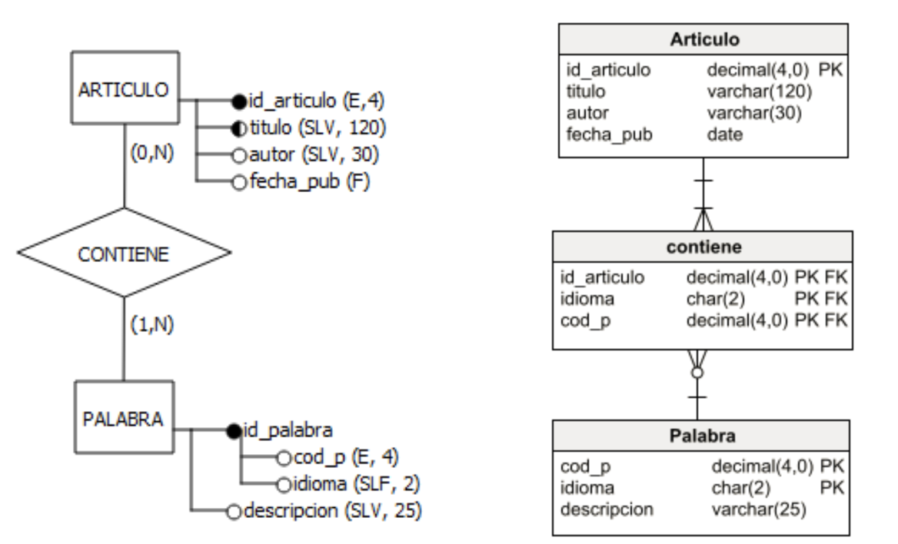
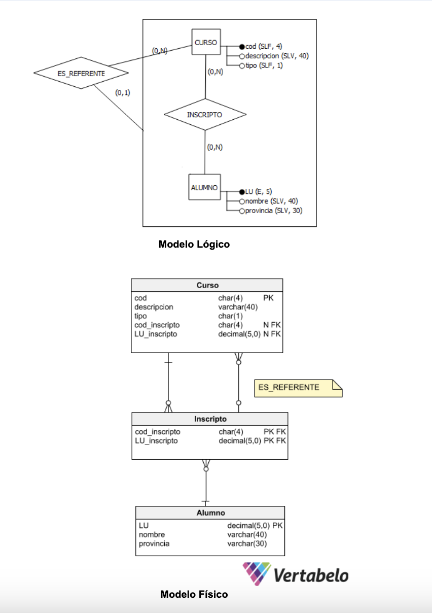

# Introducción

## Ejercicios

* Contenidos:
  * Modelo de Entidades y Relaciones Extendido. Reglas de derivación MERE → Esquema Relacional
  * Sentencias de creación, borrado y actualización de tablas con la definición de las restricciones simples (de clave primaria, de unicidad, de nulidad y de clave extranjera). Sentencias SQL CREATE, ALTER  y DROP TABLE (consultar [documentación de SQLite](https://www.sqlite.org/lang.html))

1. Para cada uno de los siguientes DERExt:
    1. Genere el modelo Físico en Vertabelo
    1. Construya un script con las sentencias SQL de creación de las tablas que lo representan incluyendo los atributos con sus características, las claves primarias, las alternativas, las restricciones de nulidad y las claves extranjeras. Nota:  Al inicio del script, realice el borrado de todas las tablas creadas (incluya  IF EXISTS)
    1. Pruebe el script generado en la base de datos para verificar que ejecute correctamente.Nota: a continuación del nombre de cada atributo hay un par de datos de la forma  (T, S) donde: T indica el tipo de atributo (E= Entero, SLV= String de Longitud Variable, SLF= String de Longitud Fija, F= Fecha, D= Decimal) y S indica el tamaño o precisión del atributo

        a. 
        b. 
        c. 

1. Escriba las sentencias en SQL para que cada tabla del ej. 1a y 1c tenga por lo menos 5 tuplas
1. Provea sentencias de actualización que:
    * Modifiquen todos los registros de una tabla
    * Modifiquen un subconjunto de tuplas de una tabla
    * Modifique sólo un registro de una tabla
1. Provea sentencias de borrado que:
    * Borren todos los registros de una tabla
    * Borren un subconjunto de los registros de una tabla
    * Borre un sólo registro de una tabla
