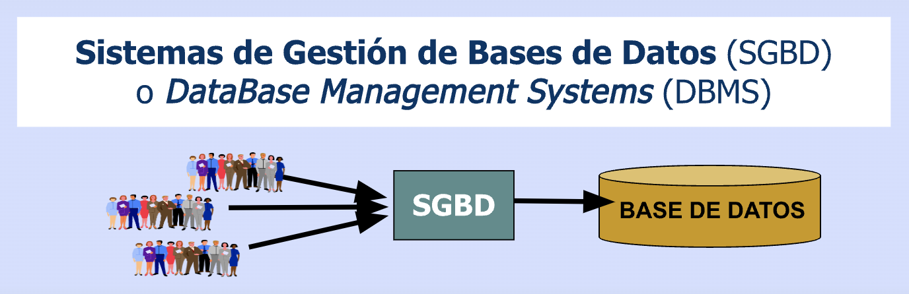
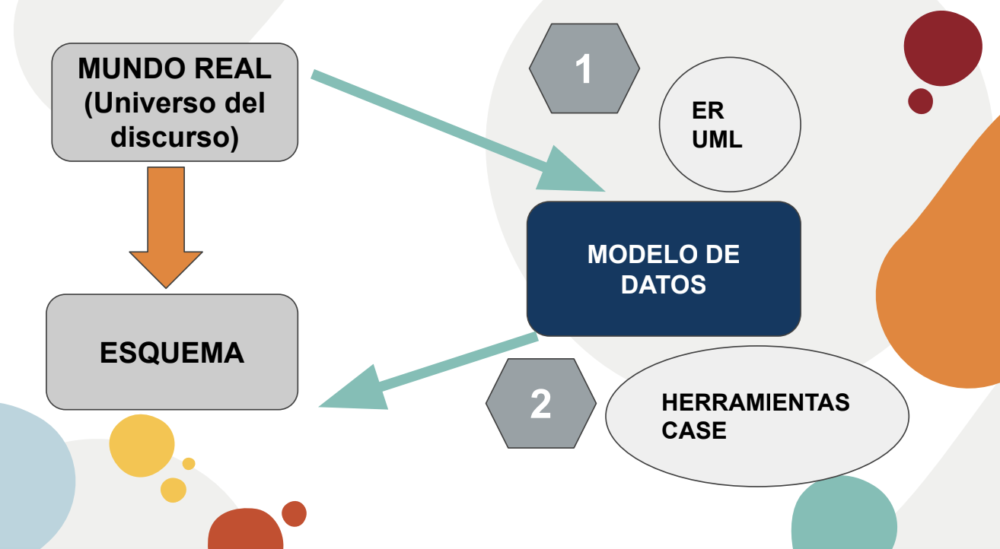

# Modelado de datos

* Parte esencial para el Diseño de **Bases de Datos** (BD)
* Las BD son una de las principales componentes de un **Sistema de Información** (SI)

  

  * Sistemas de bancos, compras online, sistemas de salud, de reservas de vuelos, hoteles, bibliotecas, etc.
  * BD Multimedia para almacenamiento y recuperación de imágenes, videos, etc.
  * Sistemas de Información Geográfica (GIS)
  * BD de gran capacidad, sistemas big data, BD NoSQL, BD para dispositivos móviles, etc.

## Sistemas de Información (SI)

* "... cualquier sistema usado para proveer información (incluyendo su procesamiento), para cualquier uso que pueda hacerse de ella ..." (Langerfors, 1982)
* El **sistema de datos** es la parte estática que alimenta el SI y se corresponde con los datos que se encuentran en la BD

  |||
  | -- | -- |
  | **DATO**         | conjunto finito de propiedades que describe un hecho |
  | **INFORMACIÓN**  | tiene significado (semántica, relevancia y propósito) |
  | **CONOCIMIENTO** | experiencia, valores, información y know-how |
  | **SABIDURÍA**    | aplicar el conocimiento para mejorar la acción |

  
  Fuente: [https://netmind.net/ojo-al-dato-mejores-decisiones-en-la-empresa/](https://netmind.net/ojo-al-dato-mejores-decisiones-en-la-empresa/)

## ¿Qué es una BD?

* Es una **colección de datos interrelacionados** con un propósito específico vinculado a la resolución de un problema del mundo real. (Bertone y Thomas, 2011)
* Por ejemplo: BD de provincias

| centroide_lat | centroide_lon | id | nombre | nombre_completo |
| -- | -- | -- | -- | -- |
| -34.6144420654301 | -58.4458763250916 | 02 | Ciudad Autónoma de Buenos Aires | Ciudad Autónoma de Buenos Aires |
| -38.6419828626673 | -70.1198972237318 | 58 | Neuquén | Provincia del Neuquén |
| -33.7611035381154 | -66.0252312714021 | 74 | San Luis | Provincia de San Luis |
| -30.7088227091528 | -60.9506872769706 | 82 | Santa Fe | Provincia de Santa Fe |
| -29.6849372775783 | -67.1817575814487 | 46 | La Rioja | Provincia de La Rioja |
| -27.3359537960762 | -66.9478972451295 | 10 | Catamarca | Provincia de Catamarca |
| -26.948283501723  | -65.3647655803683 | 90 | Tucumán | Provincia de Tucumán |
| -26.3869871835867 | -60.765116260356  | 22 | Chaco | Provincia del Chaco |
| -24.8950871761481 | -59.9321901121647 | 34 | Formosa | Provincia de Formosa |
| -48.8155471830527 | -69.9557619144913 | 78 | Santa Cruz | Provincia de Santa Cruz |
| -43.7886271389083 | -68.5267363339818 | 26 | Chubut | Provincia del Chubut |
| ... | ... | ... | ... | ... |

* Cuestiones:

  |||
  | -- | -- |
  | **Dominio de un problema**    | seleccionar la información a representar de un **dominio** de un problema específico mediante el **proceso de abstracción** |
  | **Esquema de representación** | **diseñar el esquema** de representación de los datos (interrelación) que cumpla con ciertas características |

## ¿Qué es un DBMS o SGBD?

* Database Management System (DBMS) o Sistema de Gestión de Base de Datos (SGBD)
* Es una colección de programas que permiten a los usuarios crear, administrar y mantener la BD

  

* Oracle, Informix, SQL Server, PostgreSQL, MySQL, etc.
* Ranking: [https://db-engines.com/en/ranking](https://db-engines.com/en/ranking)

## Arquitectura ANSI-SPARC (American National Standards Institute, Standards Planning And Requirements Committee)

* Es un estándar de diseño abstracto para DBMS, propuesto en 1975 por la empresa ANSI
* La mayoría de los DBMS comerciales modernos se basan en este sistema
* También se lo llama arquitectura de tres capas o niveles
* Busca separar la vista de los usuarios de los datos, de manera que ésta no los afecte
  * Permite vistas de usuario independientes y personalizadas (No interfieren entre sí)
  * Oculta los detalles físicos de almacenamiento a los usuarios
  * El administrador de la BD (DBA) debe ser capaz de cambiar las estructuras de almacenamiento de la BD sin afectar la vista de los usuarios (independencia lógica)
  * La estructura interna de la base de datos no debería verse afectada por cambios en los aspectos físicos del almacenamiento (independencia física)

### Objetivos

* Separar las aplicaciones de usuario (vistas) de los datos
* Manejar múltiples vistas por parte de los usuarios
* Usar un catálogo (metadatos) para almacenar el esquema de BD

### Niveles

| Nivel | Se refiere a ... |
| -- | -- |
| **Externo**    | las vistas que visualizan los usuarios (una parte de la BD) |
| **Conceptual** | los datos que se almacenan en la BD, sus restricciones y las relaciones que existen entre éstos |
| **Interno**    | cómo se almacenan físicamente los datos, se describen estructuras de datos complejas |

* El SGBD transforma una solicitud de usuario - **esquema externo** - a una solicitud expresada según el **esquema conceptual** y gestiona el acceso a los datos almacenados utilizando los metadatos - **esquema interno** -

  

### Se puede lograr

| Independencia | Se puede modificar la estructura ... | Sin la necesidad de ... |
| -- | -- | -- |
| **Lógica** | lógica de la BD | reescribir las aplicaciones (esquema externo o vistas de usuarios) |
| **Física** | física de la BD | alterar su estructura lógica (esquema conceptual) |

## Modelo de datos

* Es un conjunto de herramientas conceptuales que permiten describir la información que es necesaria administrar para un SI, las relaciones existentes entre estos datos, la semántica asociada y las restricciones de consistencia. (Bertone y Thomas, 2011)
* Sirven para comprender más fácilmente los datos de una organización. Se modela para:
  * Obtener la perspectiva de cada persona implicada en el problema
  * Observar la naturaleza y necesidad de cada dato
  * Observar cómo cada persona utiliza cada dato

## Modelo

* Son medios para describir la realidad
* Las personas que diseñan usan los modelos para construir esquemas, que sintetizan la realidad del problema
* Por ejemplo, en arquitectura se usan modelos y los esquemas resultantes son los planos o un render

  

## Universo del discurso o dominio del discurso o dominio (UdD)

* Es el conjunto de cosas acerca de las cuales se habla en un determinado contexto
* Dependiendo del UdD, una misma proposición podrá ser verdadera o falsa
* Al decir **«todos son amigos»**, si se está hablando acerca de un pequeño grupo de personas, la proposición quizás sea verdadera, pero si se está hablando acerca de todo el mundo, entonces es falsa

## Niveles de representación

| Nivel | En el ámbito de las BD se denominan ... |
| -- | -- |
| **ESTRUCTURA DE DATOS** | **ESQUEMA** |
| **DATOS**               | **BASE DE DATOS** |

## Modelo y Esquema

* La descripción de un cierto mundo real o UdD (p.e. una Universidad, un Banco) por medio de un **modelo de datos** da como resultado un **esquema**
* El **esquema** es la descripción de la estructura de la BD (tablas, atributos, restricciones, etc., "metadatos") y es relativamente invariante en el tiempo

## Abstracción

* Es un proceso que permite seleccionar algunas características del mundo real (UdD), dejando de lado aquellos rasgos que no son de interés

  | Tipos | | Ejemplo |
  | -- | -- | -- |
  | **Clasificación**  | Se utiliza para definir una **clase**. Una clase es la **abstracción de un objeto** y se origina a partir de las características comunes que tienen los objeto que la componen | **Juan** es una Persona |
  | **Agregación**     | Define una nueva clase a partir de un conjunto de otras clases que representan sus componentes | **Computadora** tiene Memoria, tiene Disco, tiene Procesador |
  | **Generalización** | Define una relación de **subconjunto** entre los elementos de dos o mas clases | Docente es una **Persona**, Estudiante es una **Persona** |

* Representan las formas de pensamiento utilizadas en la construcción de las ED de las BD

  |||
  | -- | -- |
  | **Clasificación** | permite identificar los campos o atributos de los elementos individuales de datos |
  | **Agregación**    | permite agrupar esos campos en registros de datos |

* Tipos de **propiedades** del mundo real:

  |||
  | -- | -- |
  | **Estáticas** | responden a lo que se suele entender como estructuras |
  | **Dinámicas** | son las operaciones que se aplican a los datos o valores almacenados en las estructuras, las cuales varían en el transcurso del tiempo |

* Elementos permitidos:

  |||
  | -- | -- |
  | **Objetos**                                                         | entidades |
  | **Asociaciones entre objetos**                                      | interrelaciones o relaciones |
  | **Propiedades** o **características** de los objetos o asociaciones | atributos |
  | **Dominios** de los atributos                                       | tipos de datos |

* Elementos no permitidos o **restricciones**:

  | Restricciones |||
  | -- | -- | -- |
  | **inherentes** | del modelo | impuestas por la naturaleza del modelo de datos. Por ejemplo: el MR, no permite que dos ejemplares de una tabla sean iguales |
  | **de integridad o semánticas** | de usuario | definidas por el usuario en el esquema de la BD, son las que permiten verificar la corrección de los datos almacenados en la BD |

## Técnicas de modelado

* Los modelos se construyen utilizando técnicas de abstracción
* Se describen mediante representaciones gráficas con una sintaxis y semántica asociadas
* Los modelos de datos se dividen en tres grandes grupos:
  * **Modelos basados en objetos**
  * Modelos basados en registros
  * Modelos de datos físicos

## Modelos basados en objetos

* Se usan para describir datos en los niveles conceptual y de vistas
* Se representan los datos de tal forma como se los capta en el mundo real
* Tienen una capacidad de estructuración flexible
* Permiten especificar restricciones de datos explícitamente
* Tipos:
  * **Modelo Entidad-Relación** (más utilizado por su sencillez y eficiencia)
  * Modelo orientado a objetos
  * Modelo de datos semántico
  * Modelo de datos funcional
