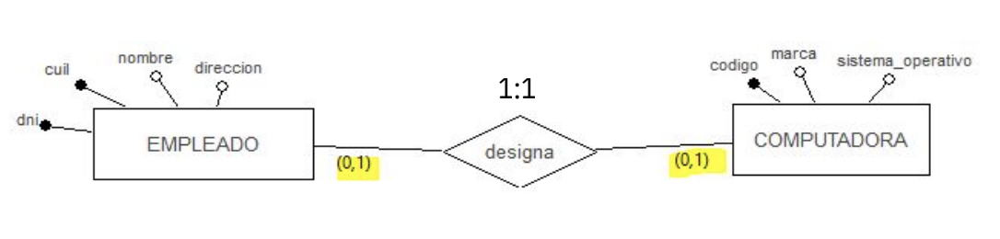

# Modelo Conceptual

## Ingeniería de Software (IS)

* Es la disciplina que abarca todos los aspectos del desarrollo de software (**ciclo de vida**)

### Ciclo de vida del software. Etapas

1. Comprender y analizar el problema
1. Diseñar la solución
1. Implementar la solución
1. Entregar el producto final
1. Modificar el producto por nuevos requerimientos

### Diseño de BD

* La metodología de diseño consiste en construir un modelo de datos en etapas:

    1. **Diseño conceptual**: luego de la etapa de especificación de requerimientos, es independiente del SGBD a utilizar y da como resultado el esquema conceptual
    1. **Diseño lógico**: tiene dos fases, una de refinamiento del esquema conceptual y otra para obtener el esquema de la BD, que depende del SGBD a utilizar. Usaremos el Modelo Relacional
    1. **Diseño Físico**: es necesario tomar decisiones específicas, que tienen que ver con el SGBD específico a utilizar (índices, clusters, archivos)

    

* Si bien el modelado de datos forma parte de la etapa de diseño, las y los analistas no la respetaron y comenzaron a realizarlo en las etapas tempranas, como parte de la comprensión del problema, para luego refinarlo en las etapas de diseño

  | Modelo | Tipo de SGBD | SGBD |
  | -- | -- | -- |
  | **Conceptual** | No se debe decidir | No se debe decidir |
  | **Lógico**     | No se debe decidir | No se debe decidir |
  | **Físico**     | No se debe decidir | No se debe decidir |

### Regla de Negocio (requisito o requerimiento)

* Descripción breve, precisa y no ambigua de una política, procedimiento o principio dentro de una organización específica
* Forman parte del **Documento de Requisitos** de un sistema, que es el producto resultante de la etapa de **análisis**
* Ejemplo:
  * "Un/a estudiante se inscribe en una carrera de la Universidad"
  * "Una cuenta corriente en pesos en el banco puede tener giro en descubierto"

## Modelo Entidad-Relación (MER)

* Modelo conceptual de BD
* "Los modelos de datos conceptuales permiten representar la información de un problema en un alto nivel de abstracción"

  | Características ||
  | -- | -- |
  | **Expresividad** | capturar y presentar de la mejor forma posible la semántica de los datos del problema a resolver |
  | **Minimalidad**  | cada elemento del modelo tiene una única forma de representación |
  | **Formalidad**   | requiere que cada elemento representado en el modelo sea preciso, bien definido y con una sola interpretación posible |
  | **Simplicidad**  | el modelo debe ser fácil de entender por todas las personas involucradas (clientes, analistas, etc.) |

### Historia del MER

* **Peter Chen**: publicó en 1976 un documento llamado "Modelo entidad-relación: hacia una visión unificada de los datos", que posee las bases para la representación básica de las ED que darán soporte a las BD

### ¿Qué es?

* Un diagrama entidad-relación (DER), también conocido como MER o ERD o ER, es un tipo de diagrama de flujo que ilustra cómo las "entidades" (personas, objetos o conceptos) se relacionan entre sí dentro de un sistema

### Constructores

* Conjunto definido de símbolos (rectángulos, rombos, óvalos y líneas de conexión) para representar la interconexión de entidades, relaciones y sus atributos respectivamente

### Dominio

* Es un reflejo de la estructura gramatical del documento de requisitos y emplea sustantivos para las entidades y verbos para las relaciones

### MER - constructores básicos

* Entidades
* Relaciones entre esas entidades (interrelaciones)
* Atributos

* Ejemplo: regla de negocio "Un/a **estudiante** se ***inscribe*** en una **carrera** de la Universidad"

### Entidad

* Una cosa u objeto en el mundo real que es distinguible de todos los demás objetos (Korn)
* En el Documento de Requisitos aparecen reflejadas "habitualmente" como **"sustantivos"**
* A cada una de las posibles ocurrencias de la entidad se la denomina **"ejemplar"**
* Tiene características o propiedades específicas - **Atributo** - que la describe
* Ejemplo:

  ```plain
  Existe un estudiante con:
    Nombre: Juan
    Apellido: Pérez
    DNI: 20.123.456 Legajo: 234569/5
    Dirección: Rivadavia 456 
    Teléfono: 236-444897
    Mail: juan_perez@gmail.com
  ```

* **Notación**: **rectángulo**. El nombre es generalmente un sustantivo escrito en plural. Los **atributos** se denotan con **una línea y un óvalo**

  

### Atributo

* Describe las características importantes de cada entidad
* Atributo = (nombre, valor) para cada entidad
* **Dominio del atributo**: conjunto de valores permitidos para un atributo (dominio de datos)
* **Funciones**: identificadores y descriptores
* Ejemplo:

  ```plain
  Entidad ESTUDIANTES
  Atributos: nombre, apellido, teléfono, dirección son descriptores
  Atributos: dni, legajo, mail son identificadores

  ¿Por qué? ¿Y si tengo un pasaporte como DNI porque es un estudiante de intercambio y es
  una persona extranjera?
  ```

* **Definición de Dominios**

  ||| Ejemplo |
  | -- | -- | -- |
  | **Por comprensión** | indicando el tipo de dato | precio: "números reales mayores que cero" |
  | **Por extensión**   | definiendo los valores del conjunto | sexo = {M, F, X} |

* **Tipos de datos básicos**:

  |||
  | -- | -- |
  | **Datos para Cadenas de caracteres** | CHAR, VARCHAR |
  | **Datos Numéricos**                  | INT, FLOAT, REAL, DECIMAL |
  | **Datos para Fechas y Horas**        | DATE, TIME, DATETIME, TIMESTAMP |
  | **Datos Booleanos**                  | BOOLEAN |

* **Clasificación (restricciones semánticas sobre los atributos)**

  ||| Ejemplo |
  | -- | -- | -- |
  | **Obligatorios u opcionales** | si un atributo debe o no tomar un valor (Valores Nulos) - **Cardinalidad Mínima** | |
  | **Simples**                   | atributos que no son divisibles | código de curso, nombre |
  | **Compuestos**                | atributos formados por varios atributos simples | domicilio con ciudad, calle y número, CP |
  | **Univaluados o monovalentes**   | pueden tomar solo un valor de su dominio | fecha_nac (1,1) o prepaga (0,1) |
  | **Multivaluados o polivalentes** | toman más de un valor del dominio de datos | teléfonos (1, N), titulos (0, N) |
  | ***Derivados o calculados**      | pueden ser calculados a partir de otros atributos | edad = fecha_actual - fecha_nac |

* **Cardinalidad de atributos**: cuántos valores del dominio puede tomar un atributo. Se denota como par ordenado (card min, card max)

  |||
  | -- | -- |
  | **Cardinalidad mínima** | 0 o 1 (u otro valor) |
  | **Cardinalidad máxima** | 1 o N (u otro valor) |
  | Por **convención** la cardinalidad de los atributos cuando es | (1,1) no se especifica en el modelo |

* **Tipos de atributos**

  

* **Valores nulos**: algunos atributos pueden no tener un valor específico para una entidad. ¿Qué significa aceptar un valor nulo?

  ||| Ejemplo: Piso = NULL |
  | -- | -- | -- |
  | **Valor no aplicable** | no tiene sentido dar un valor de atributo para el ejemplar de la entidad | cuando es una casa |
  | **Valor perdido**      | el valor existe pero no se tiene | existe el piso pero no se sabe cual es |
  | **Valor no conocido**  | no se sabe si existe o no hat valor para el ejemplar | no se sabe si la dirección corresponde a un bloque de pisos o a una casa |

* **Atributo identificador o clave**
  * Restricción de unicidad del valor del atributo
  * Sirve para identificar de manera única a cada ejemplar de una entidad
  * Tiene que tener un valor conocido para cada entidad, no puede ser nulo

  

### Relación

* Son vínculos entre una o varias entidades
* Pueden tener atributos
* **No** pueden tener atributos identificadores en el modelo conceptual
* En los documentos de requisitos la aparición de **verbos** podrá indicar la existencia de una relación en el MER

* **Notación**: **rombo**. Nombre de la relación verbo o verbo seguido de una preposición

  

* Ejemplo:

  ```plain
  Existe un estudiante con los datos:
    Nombre: Juan Apellido: Pérez DNI: 20.123.456
    Legajo: 234569/5 Mail: juan_perez@gmail.com
    Dirección: Rivadavia 456 
    Teléfono: 236-444897
  Que cursa la asignatura con los datos:
    Nombre: Introducción a las bases de datos
    Código: 726
  ```

* Ejemplos:
  * Los estudiantes cursan asignaturas
  * Un estudiante puede cursar muchas asignaturas
  * Una asignatura puede estar en varias carreras
  * Un curso de posgrado no se abre para menos de 10 o más de 30 estudiantes

* **Características**:

  ||||
  | -- | -- | -- |
  | **Grado**         | cantidad de entidades involucradas en una relación | unarias o recursivas, binarias, ternarias, n-arias |
  | **Cardinalidad**  | número mínimo y máximo de ejemplares de una entidad que puede vincularse con un ejemplar de la otra entidad. Es un tipo de restricción que se utiliza para comprobar y mantener la calidad de los datos | |
  | **Conectividad**  | tipos de relación de acuerdo a su cardinalidad máxima | 1:1, 1:N, N:N ó N:M |
  | **Participación** | importancia de la cardinalidad mínima | **total** (participación obligatoria) o **parcial** (participación no obligatoria) |

* **Notación cardinalidad**: par ordenado para cada entidad que participa en la relación (card min, card max). Representamos la cardinalidad de la entidad en la relación, ubicándola al lado de ella
  * Ejemplo: un empleado trabaja en un único departamento de forma obligatoria. En el departamento trabajan muchos empleados. Como mínimo debe trabajar un empleado en el mismo

    

* **Conectividad N:N**: los empleados son asignados a proyectos, en una fecha en cada proyecto en particular

    

* **Conectividad 1:N**: cada empleado trabaja en un único departamento de forma obligatoria

    

* **Conectividad 1:N**: los empleados pueden o no afiliarse a un sindicato

    

* **Conectividad 1:1**: los empleados deben tener licencia de conducir

    

* **Conectividad 1:1**: los empleados pueden tener licencia de conducir

    

* **Conectividad 1:1**: los empleados pueden tener asignada una computadora. Las computadoras pueden no estar asignadas a nadie

    

* **Relaciones unarias o recursivas**: es una relación de una entidad consigo misma

* **Ejemplos relaciones unarias**: hay empleados que son jefes de otros empleados. Los empleados tienen una pareja de trabajo en equipo

    

## MER extendido

### Entidades fuertes y débiles

* Dadas dos entidades A y B, se dice que la entidad A tiene **dependencia de existencia** de
B entonces:
  * Un ejemplar de A depende de la existencia de un ejemplar de B
  * Si un ejemplar de B se borra, se han de borrar los ejemplares dependientes de ella en A
* Siempre la cardinalidad de la entidad débil es (1,1)

  

### Jerarquías y subconjuntos (concepto de herencia)

* **Por Especialización**: es una representación que permite crear una entidad con atributos comunes a varias entidades y luego **subentidades** que especializan el concepto de la **superentidad**

  

* **Por Generalización**: permite extraer propiedades comunes de varias entidades y generar con ellas una superentidad que las aglutina. Es en el sentido contrario de especialización

  

* **Cobertura**: define el grado de la relación entre la superentidad y las subentidades. (Relación "es un" dada de forma impícita por la herencia)

  |||
  | -- | -- |
  | **Total**       | cuando cada ejemplar de la superentidad está contenido obligatoriamente en alguna de las subentidades |
  | **Parcial**     | cuando pueden existir ejemplares de la superentidad que no estén contenidos en ninguna de las subentidades |
  | **Exclusiva**   | si un ejemplar de la superentidad está relacionado con una sola subentidad |
  | **Superpuesta** | si un ejemplar de la superentidad está relacionado con más de una subentidad |

  

  

* **Subconjunto**: representan un caso especial de la jerarquía. Hay situaciones en donde sólo se desprende una sola subentidad. No es necesario colocar la cobertura, ya que ésta nunca será total, si no sería una copia exacta de la superentidad. Además, no puede ser superpuesta, ya que no hay otra subentidad con la que superponerse. Por lo tanto, un subconjunto siempre es Parcial y Exclusivo, y, por ende, no se anota la cobertura

  

### Restricciones

* **De Exclusividad**: dos o más relaciones tienen una restricción de exclusividad con respecto a una entidad que participa en ambas relaciones, si cada ejemplar de la entidad sólo puede participar en una y sólo una de las relaciones, es decir, no puede participar en ambas a la vez. Ejemplo: un libro es editado por un editorial o por la universidad, nunca por ambos

  

* **De Inclusividad**: se presenta cuando todo ejemplar de una entidad A que participa en una relación R2, ha tenido que participar obligatoriamente de forma previa en la relación R1. Ejemplo: supongamos que ahora un profesor sólo puede impartir clases en nuestro programa de doctorado si ha realizado al menos un curso dentro del mismo

  

### Ejercicio

1. Una empresa constructora tiene diferentes empleados. De todos ellos se sabe su CUIT, su DNI, nombre, teléfono y dirección. Los empleados son contratados en relación de dependencia, es decir, cobran un salario mensual y por horas
1. De los asalariados se sabe su sueldo mensual, el porcentaje de descuentos y los aportes
1. De los contratados por Jornada se almacenan la cantidad de horas trabajadas, los días trabajados, el precio por hora y el servicio que prestan que puede ser plomería, electricidad, etc.
1. Además, los empleados asalariados pueden ser administrativos, albañiles y arquitectos
1. De los arquitectos se sabe su número de matrícula y universidad donde obtuvo la titulación
1. De los administrativos se sabe qué tipo de tarea hacen y si tiene o no título secundario. Las tareas pueden ser telefonista, administrativo, seguridad y aseo

### Historia en la BD

* Modelar fechas o períodos de tiempo
* Ejemplo: un empleado trabaja en un proyeto durante un período de tiempo
* Cuando deja de trabajar en el proyecto, deja de participar de la relación

  

* **Introduciendo la HISTORIA**: se refleja el paso del tiempo - relación N:N

  

* **Historia en las entidades**: Ejemplo, tenemos la entidad empleados que trabajan en un supermercado y se sabe, además de sus datos personales y su cargo, la fecha de inicio en que comenzó a trabajar y en el caso de que ya no trabaje más, se sabe su fecha de fin de las actividades en el supermercado. De esta forma, con las fechas, podemos saber qué empleados forman y formaron parte del supermercado

  

### Relaciones ternarias

* Es una interrelación que relaciona a tres entidades
* Pueden llegar a ser confusas en su interpretación semántica dependiendo de la cardinalidad
* Por esta razón, algunos autores no las definen ni las usan y buscan modelar lo mismo con relaciones binarias
* Solo las usaremos cuando las tres entidades participen con card. Máx = N
* Ejemplo: UdD trata de una organización que asigna proyectos a sus empleados de sus distintos departamentos. Reglas de negocio:

* En la organización hay departamentos, cada empleado pertenece a un departamento de forma única

  

* En los departamentos se originan proyectos y estos proyectos se dividen en tareas

  

* En las tareas se utilizan insumos de distintos proveedores, se necesita almacenar qué insumos fueron provistos por ciertos proveedores en cada tarea y en qué fecha

  

* Distintos proveedores suministran distintos tipos de componentes a distintos proyectos

  

* Algunos autores plantean solamente representar relaciones binarias

  

### Agregaciones

* Cuando se genera una relación ternaria, tres entidades confluyen en ella. En ciertos casos esta representación pierde claridad o expresividad. (algunos autores las consideran incorrectas)
* La agregación permite visualizar a un par de entidades y una relación como una gran entidad que a su vez se relaciona con otra
* Ejemplo: El **empleado** participa en muchos **proyectos**, pero en cada proyecto, el empleado realiza una **tarea** particular. Pero una tarea en un proyecto, puede ser realizada por más de un empleado

  

* Ejemplo: Una agencia de Recursos Humanos ENTREVISTA varios CANDIDATOS para varias EMPRESAS. La entrevista puede dar lugar a una OFERTA de TRABAJO

  
