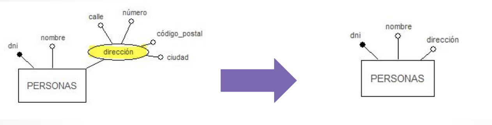

# Modelo Lógico Fase I - Reestructuración

## Diseño Lógico

* Para implementar el esquema ER obtenido en el diseño conceptual en un DBMS, es necesario excluir una serie de situaciones que perjudican el diseño (proceso de normalización)
* Se busca el debido equilibrio entre las exigencias de los usuarios y la eficiencia del DBMS:
  * conseguir máxima simplicidad
  * eliminar redundancias
  * evitar cargas de programación, etc.
  * Se obtiene un esquema lógico para el modelo de datos soportado por el DBMS

  

* El modelo más usado entre los DBMS actuales es el RELACIONAL

## Modelo Lógico Fase I - Reestructuración -

* Elementos del DER a transformar:
  1. Resolver atributos polivalentes de las entidades
  1. Resolver atributos compuestos de las entidades
  1. Resolver las jerarquías
  1. Identificar y controlar las redundancias: atributos calculados
  1. Identificar y controlar las redundancias de las relaciones: ciclos redundantes y no redundantes
  1. Fusión y/o División de entidades y/o relaciones

### Resolver atributos polivalentes de las entidades

* Los atributos multivaluados o polivalentes requieren de entidades nuevas
* Cada atributo polivalente requiere una nueva entidad en la cual pueda estar representado como un
atributo monovalente
* La nueva entidad es DÉBIL, depende en identificación de la entidad que le dio origen

  

### Resolver atributos compuestos de las entidades

| Posibilidades | Cuando usar ... | Ejemplo |
| -- | -- | -- |
| Descomponer el atributo compuesto en sus atributos simples | cuando se necesita acceder a cada dato de la dirección de forma separada |  |
| Concatenar el valor de los atributos simples en un solo atributo simple | cuando NO se necesita acceder a cada dato de la dirección de forma separada |  |
| Crear una nueva entidad para el atributo compuesto | Cuando el sistema puede crecer a futuro y permitir más de una dirección por persona |  |

### Resolver las jerarquías

* Los esquemas relacionales no permiten representar las jerarquías, en consecuencia se deben modelar usando sólo entidades y relaciones
* Posibilidades:
  * Eliminar a las subentidades
  * Eliminar a la superentidad
  * Dejar todo y hacer explícita la herencia por medio del uso de relaciones "es_un"

  

* **Eliminar a las subentidades**

  

  | Ventajas | Desventajas |
  | -- | -- |
  | Es la solución más simple desde el punto de vista del esquema resultante | Puede generar una gran cantidad de valores nulos para los atributos que se aplican sólo a las subentidades |
  | Esta alternativa es aplicable a todos los tipos de cobertura: total o parcial, superpuesta o exclusiva | Todas las operaciones que tenían acceso sólo a las subentidades tienen que buscar ahora el caso correspondiente dentro del conjunto completo de casos de la superentidad |

* **Eliminar a la superentidad**

  

  | Desventajas |
  | -- |
  | Se pierde el concepto de herencia, donde las subentidades originales son subconjuntos de la superentidad |
  | Si el número de atributos y relaciones de la superentidad (comunes a todas las entidades) es excesivo, su duplicación en el esquema en cada subentidad no se justifica |
  | Cada operación que originalmente tenía acceso sólo a la superentidad, ahora debe tener acceso a todos los casos de todas las subentidades |

* **Dejar todo y hacer explícita la herencia por medio del uso de relaciones "es_un"**

  

  | Ventajas | Desventajas |
  | -- | -- |
  | Sirve para todas las coberturas: TOTAL/PARCIAL, EXCLUSIVA/SUPERPUESTA | Para insertar un nuevo ejemplar en una subentidad se requiere insertar dos ejemplares adicionales: uno para la superentidad y otro para la relación “es_un” con la superentidad |
  | | Hay una redundancia inherente (al menos en el nivel conceptual) al representar cada eslabón ES_UN en la jerarquía original a través de una interrelación explícita |

### Identificar y controlar las redundancias: atributos calculados

* Un elemento de un esquema conceptual es redundante cuando puede ser eliminado sin pérdida de semántica (información)
* Debemos controlar la redundancia que hay en el esquema, para no dar lugar a inconsistencias. Para
ellos debemos revisar dos tipos de elementos:
  * Atributos Derivados (o Calculados)
  * Ciclos entre entidades y relaciones

* Ejemplo: Existen cursos que tienen diferentes ediciones del mismo a lo largo del tiempo

  

* No dan lugar a inconsistencias siempre que se indique en el esquema lógico que son atributos derivados y se especifique la fórmula para calcularlos
* No se debe incluir en el esquema conceptual o lógico atributos derivados sólo por razones de eficiencia, sino en el esquema físico

### Identificar y controlar las redundancias de las relaciones: ciclos redundantes y no redundantes

* Una **relación es redundante** cuando su eliminación no implica pérdida de semántica
* Esto se da cuando existe la posibilidad de realizar la misma asociación de los ejemplares por medio
de otras relaciones
* Condición necesaria para que la relación sea redundante: que forme parte de un **ciclo**
* Se deben estudiar detenidamente los ciclos en los DER
* Si no hay ciclos no puede haber relaciones redundantes
* Si hay ciclos, puede ser y dependen de la cardinalidad de las relaciones, de los atributos y de la semántica del problema

* Ejemplo: Un profesor sólo puede dictar cursos que pertenezcan al departamento al que él está adscrito

  

* Si se conocen los cursos de doctorado que dicta un profesor y el departamento al que pertenece cada curso ==> Se puede deducir a qué departamento está adscrito el profesor
* Dado un departamento, si conocemos sus cursos y conocemos los profesores que imparten los cursos ==> conoceremos los profesores asociados al departamento
* En conclusión, la relación "adscritos" entre PROFESOR y DEPARTAMENTO puede deducirse a partir de otras interrelaciones, entonces es redundante, ya que su eliminación no produciría pérdida de información. Lo mismo sucede con la relación "pertenecen"

### Fusión y/o División de entidades y/o relaciones

* PRINCIPIO: Los accesos a la BD se reducen separando atributos/relaciones de un mismo concepto, que se
acceden por diferentes operaciones o mezclando atributos/relaciones de diferentes conceptos que se acceden por las mismas operaciones

* **División de entidades**: Ejemplo: se divide la entidad de empleados en dos entidades, una con la información que tiene que ver con sus datos personales y otra entidad con los datos sobre su
liquidación de sueldo. Ya que son accedidos por subsistemas diferentes

  

* **Fusión de entidades**: Ejemplo: Se fusionan las entidades personas y los departamentos de los que son dueños. **Efecto colateral**: se obtienen atributos que permiten valores NULOS (NULL). Generalmente se hace sobre relaciones 1:1, rara vez sobre 1: N y prácticamente: nunca sobre N:N

  
