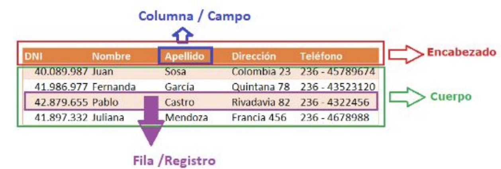
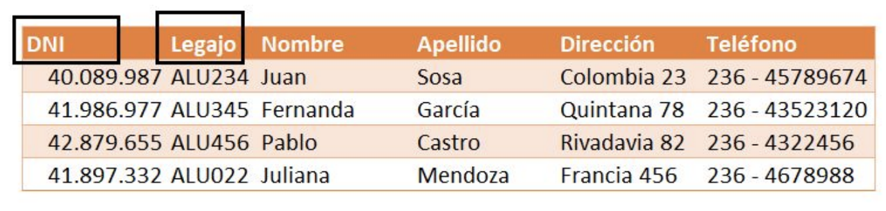
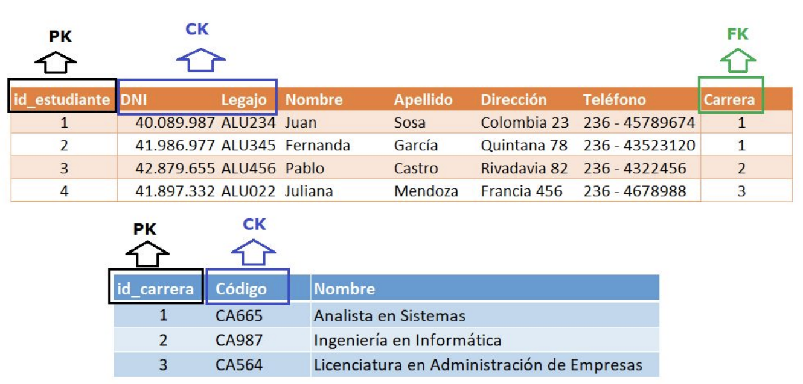

# Modelo Relacional (MR)

* "El modelo relacional representa a una BD como una colección de archivos denominados tablas, las cuales se conforman por registros. Cada tabla se denomina relación, y está integrada por filas horizontales y columnas verticales. Cada fila representa un registro del archivo y se denomina tupla, mientras que cada columna representa un atributo del registro" (Bertone y Thomas)

## Características

* Existe una relación entre los componentes del diseño conceptual y el diseño lógico

  | Diseño Conceptual | Diseño Lógico |
  | -- | -- |
  | Entidad          | Tabla o Relación |
  | Relación         | Relación |
  | Atributo         | Campo o Columna |
  | Ejemplar / Tupla | Tupla / Registro / Fila |

* Representa a la BD como una colección de relaciones (tablas)
* Cada relación se asemeja a una tabla de valores, donde cada fila representa una colección de valores relacionados entre sí (Registro de datos) y cada columna es un atributo del registro
* Notación:
  * **nombre_relacion = (atributo1, atributo2, ..., atributon)**
  * **estudiantes = (dni, nombre, apellido, direccion, telefono)**

* Las **relaciones** pueden verse como tablas
* Por ejemplo, tenemos la relación (tabla) estudiantes:

  | dni | nombre | apellido | direccion | telefono |
  | -- | -- | -- | -- | -- |
  | 40.089.987 | Juan  | Sosa    | Rivadavia 882 | 444852 |
  | 36.852.145 | Carla | Díaz    | Alem 23       | 452896 |
  | 27.858.369 | Lucía | Andrade | Chile 41      | 448596 |

* El esquema relacional es una estructura de datos normalizada que tiene las siguientes propiedades:
  * Cada entrada (fila) en la tabla / relación representa a un solo ejemplar de la entidad
  * No hay atributos (columnas) multivaluados
  * Cada columna tiene datos que significan lo mismo y son del mismo tipo
  * A cada columna se le asigna un nombre diferente
  * Todas las filas son distintas. No se permiten filas duplicadas. Se generan claves primarias (PK)

## Componentes

|||
| -- | -- |
| **Atributo (Columna o Campo)** | característica del dato. Columna = (nombre, valor) |
| **Dominio**                    | conjunto de valores atómicos posibles para un campo. (Tipo de datos) |
| **Tupla (Registro o Fila)**    | conjunto ordenado de valores que describe las características del dato en un momento dado |
| **Relación / Tabla**           ||
| **Clave**                      ||
| **Restricción**                ||

## Relaciones

* Una **relación** sobre un dominio D1, D2, ..., Dn (Di no necesariamente distintos) consiste en un encabezado y un cuerpo
  * **Encabezado**: conjunto fijo de atributos A1, A2, ..., An tal que cada atributo Ai corresponde exactamente a un dominio Di
  * **Cuerpo**: conjunto variable de tuplas, donde cada tupla consiste de un conjunto de pares (atributo,valor), (Ai, Vi) i = 1, ..., n. Hay un par para cada atributo del encabezado. Vi es un valor en el dominio Di

* **Grado**: número de atributos de la relación
* **Cardinalidad**: número de tuplas de la relación

  

* **Propiedades**:
  * No hay filas duplicadas en una relación
  * Las filas están desordenadas
  * Los campos están desordenados
  * Todos los valores de los campos son atómicos
  * Relación = Tabla = Data File

## Claves

* Sirven para identificar o relacionar las filas de las tablas, dependiendo del tipo de clave que sean

### Clave Candidata (CK)

* Es un **identificador único** para las **filas** de una relación o tabla
* Es **semántica** o natural, es decir, surge del universo del discurso
* Toda relación tiene al menos una clave candidata y en la práctica, puede tener varias. Hay algunos casos en donde puede no tener ninguna
* **Propiedades: No nula y única**. (NOT NULL – UNIQUE)

  

### Clave Primaria (PK)

* Es un **identificador único** para las **filas** de una relación o tabla
* Es una clave candidata que ***se elige como clave primaria*** para representar a una relación
* Las demás claves candidatas (CK) no elegidas como PK se llaman ***claves alternativas***

### Clave Primaria Subrogada (ID)

* Se introduce un atributo (campo) en las tablas que cumple con las siguientes propiedades:
  * Valor numérico entero, único, no nulo y autoincrementable
  * No tiene significado semántico o natural para el universo del discurso, es independiente de los datos

* **Garantiza**:
  * Menor tamaño de almacenamiento para la clave, ya que es un número entero
  * Indexación más óptima
  * Se los llama ID y es usado como PK

### Clave Foránea (FK)

* Es un campo (o combinación de campos) en una relación (tabla) R2 cuyo valor debe "matchear" (coincidir) con la PK de una relación (tabla) R1 (R1 y R2 no necesariamente distintas)

  

## Restricciones (Constraint)

* Se deben declarar para una correcta definición del esquema relacional de una BD

### Restricción de Integridad de Tablas

* Un campo que participa como PK de una tabla, **no acepta valores nulos (NULL)**
* Un NULL representa una "propiedad inaplicable" o un "valor desconocido". Las filas (registros) son identificables en el MR, por lo que su PK no puede ser nula

### Restricción de Integridad Referencial

* Si una relación R2 incluye una FK que matchea con una PK de otra relación R1, entonces todo valor de FK en R2 debe tener su valor equivalente como PK en alguna fila de R1 o debería ser NULL
* R1 y R2 no son necesariamente distintas. (Relaciones recursivas)

* **¿Por qué una FK puede permitir nulos?** En el ejemplo anterior:
  * podría desconocerse la carrera de la/el estudiante, dependiendo de las reglas de negocio
  * En este caso, el campo carrera que es una FK en la tabla estudiantes, que referencia a una PK de la tabla carreras, debería permitir valores nulos

* **¿Qué sucede si se elimina la fila en la relación que contiene la PK referenciada por la FK?**
* En el ejemplo anterior, ¿qué pasaría si se desea eliminar la carrera en la cual una/un estudiante se inscribió?

* Tenemos distintas opciones:

  |||
  | -- | -- |
  | **Cascade**              | se elimina en cascada. Si la carrera es eliminada, se eliminan a todos sus estudiantes |
  | **Restrict o No Action** | la eliminación es restringida. No se puede eliminar la carrera si hay inscripciones de estudiantes |
  | **Set Null**             | la FK es seteada a NULL. Se elimina la carrera y a la/el estudiante se le setea NULL en el valor del campo de la FK |
  | **Set Default**          | la FK es seteada a un valor por defecto. Se elimina la carrera y a la/el estudiante se le setea un valor en el campo de la FK, por ejemplo, el valor 99999999999 |

* ¿Qué sucede si se modifica la fila en la relación que contiene la PK referenciada por la FK?
  * **Los ID de las PK no deben modificarse**

### Restricción de Integridad Semántica

* Son las restricciones dadas por las reglas de negocio

  | Restricción | Ejemplo |
  | -- | -- |
  | Restricciones de dominio | Sexo = {F, M, X} |
  | Valores por defecto      | Cantidad = 0     |
  | No permitir nulos        | NOT NULL         |
  | Restricción de unicidad  | UNIQUE           |  
  | Restricciones que especifican una condición | (Check o Triggers) |
  |   - Check                                   | un campo solo toma valores enteros entre 0 y 10 |
  |   - Triggers                                | calcular automáticamente el valor de los campos calculados |

## Transformación al Esquema Relacional

* Las **tres reglas básicas** para convertir un esquema de ER (lógico) al esquema relacional son las siguientes:
  * Todo tipo de **entidad** se convierte en una **tabla**
  * Todo tipo de **interrelación N:N** se convierte en una **tabla**
  * Todo tipo de **interrelación 1:N** da lugar al fenómeno de **"propagación de clave"** ó a la **creación** de una **nueva tabla**
