# Modelo Lógico Fase II - Transformación al MR

## Transformación de Entidades

* **Todas** las **entidades** se transforman a **tablas**
* Los **atributos identificadores** del DER serán ahora **CK**: ÚNICAS Y NO NULAS
* **Todos los atributos permiten nulos por defecto**, si no se indica lo contrario. Para **fines prácticos**, cuando lo resolvamos en un documento de texto, supondremos que no permiten nulos por defecto, y aclararemos cuando sí lo permitan
* A cada tabla se le agrega una **clave subrogada (ID)**: número entero autoincrementable, único y no nulo y será la PK de la tabla

  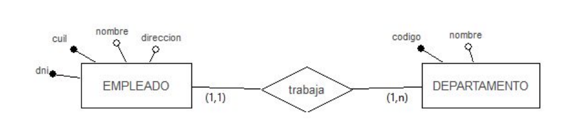

  |||
  | -- | -- |
  | **empleado** (idemp, dni, cuil, nombre, direccion) | PK(idemp)   CS(idemp)   CK(dni)   CK(cuil) |
  | **departamento** (iddepto, codigo, nombre)         | PK(iddepto) CS(iddepto) CK(codigo)         |

## Transformación de Relaciones N:N con PK subrogada

* Por definición se crea una nueva tabla por la interrelación N:N

  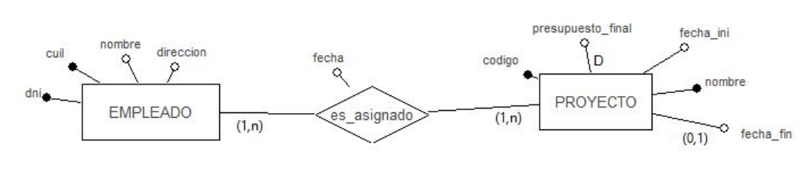

  |||
  | -- | -- |
  | **empleado** (idemp, dni, cuil, nombre, direccion)                             | PK(idemp)  CS(idemp)  CK(dni)    CK(cuil) |
  | **proyecto** (idproy, codigo, nombre, fecha_ini, fecha_fin, presupuesto_final) | PK(idproy) CS(idproy) CK(codigo) CK(nombre) fecha_fin permite nulos |
  | ***es_asignado (idasignado, emp, proy, fecha)***                               | ***PK(idasignado) CS(idasignado) CK(emp + proy) FK(emp, empleado) FK(proy, proyecto)*** |

## Transformación de Relaciones 1:N. Caso participación obligatoria (1,1)

  -n.png)

  |||
  | -- | -- |
  | **empleado** (idemp, dni, cuil, nombre, dirección, ***depto***) | PK(idemp)   CS(idemp)   CK(dni)    CK(cuil) ***FK(depto, departamento)*** |
  | **departamento** (iddepto, codigo, nombre)                      | PK(iddepto) CS(iddepto) CK(codigo)                                        |

## Transformación de Relaciones 1:N. Caso participación no obligatoria (0,1)

  -n.png)

  | Con propagación de clave ||
  | -- | -- |
  | **empleado** (idemp, dni, cuil, nombre, direccion, depto, ***sind, fecha***)   | PK(idemp)  CS(idemp)  CK(dni)    CK(cuil) FK(depto, departamento) ***FK(sind, sindicato) sind, fecha permiten nulos***. No es buena solución porque permite campos nulos |
  | **sindicato** (idsind, codigo, nombre, federacion)                             | PK(idsind) CS(idsind) CK(codigo) CK(nombre) |

  | Con creación de tabla ||
  | -- | -- |
  | **empleado** (idemp, dni, cuil, nombre, dirección, depto) | PK(idemp)  CS(idemp)  CK(dni)    CK(cuil)   FK(depto, departamento) |
  | **sindicato** (idsind, codigo, nombre, federacion)        | PK(idsind) CS(idsind) CK(codigo) CK(nombre)                         |
  | ***afiliado (emp, sind, fecha)***                         | ***PK(emp) emp no es autoincremental, es entera, única y no nula FK(sind, sindicato) FK(emp, empleado)*** |

## Transformación de Relaciones 1:1. Participación de ambas entidades en la relación es Obligatoria

  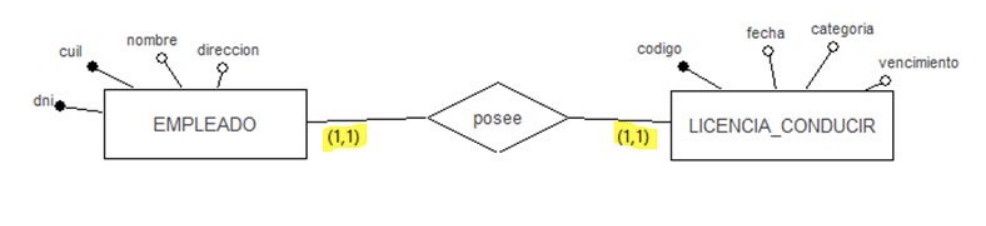

  |||
  | -- | -- |
  | **empleado** (idemp, dni, cuil, nombre, direccion, depto)                            | PK(idemp)      CS(idemp)      CK(dni)    CK(cuil) FK(depto, departamento) |
  | **licencia_conducir** (idlicencia, codigo, fecha, vencimiento, categoria, ***emp***) | PK(idlicencia) CS(idlicencia) CK(codigo) ***FK(emp, empleado)*** |

## Transformación de Relaciones 1:1. La Participación de una de las entidades en la relación es Obligatoria y la participación de la otra entidad es No Obligatoria

  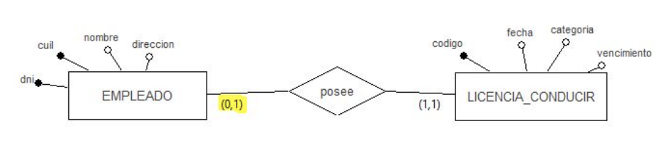

  | Con propagación de clave ||
  | -- | -- |
  | **empleado** (idemp, dni, cuil, nombre, dirección, depto)                            | PK(idemp)      CS(idemp)      CK(dni)    CK(cuil) FK(depto, departamento) |
  | **licencia_conducir** (idlicencia, codigo, fecha, vencimiento, categoria, ***emp***) | PK(idlicencia) CS(idlicencia) CK(codigo) ***FK(emp, empleado)*** |

  | Con creación de tabla ||
  | -- | -- |
  | **empleado** (idemp, dni, cuil, nombre, dirección, depto)                 | PK(idemp)      CS(idemp)      CK(dni)    CK(cuil) FK(depto, departamento) |
  | **licencia_conducir** (idlicencia, codigo, fecha, vencimiento, categoria) | PK(idlicencia) CS(idlicencia) CK(codigo)                                  |
  | ***posee (emp, licencia)***                                               | ***PK(emp) emp no es autoincremental, es entera, única y no nula FK(emp, empleado) FK(licencia, licencia_conducir)*** |

## Transformación de Relaciones 1:1. Participación de ambas entidades en la relación es No Obligatoria

  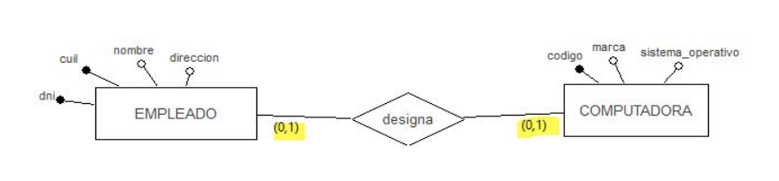

  |||
  | -- | -- |
  | **empleado** (idemp, dni, cuil, nombre, dirección, depto)  | PK(idemp)  CS(idemp)  CK(dni)    CK(cuil) FK(depto, departamento) |
  | **computadora** (idcomp, codigo, marca, sistema_operativo) | PK(idcomp) CS(idcomp) CK(codigo)                                  |
  | ***designa (emp, comp)***                                  | ***PK(emp) emp no es autoincremental, es entera, única y no nula FK(emp, empleado) FK(comp, computadora)*** |

## Transformación de Entidades Débiles

  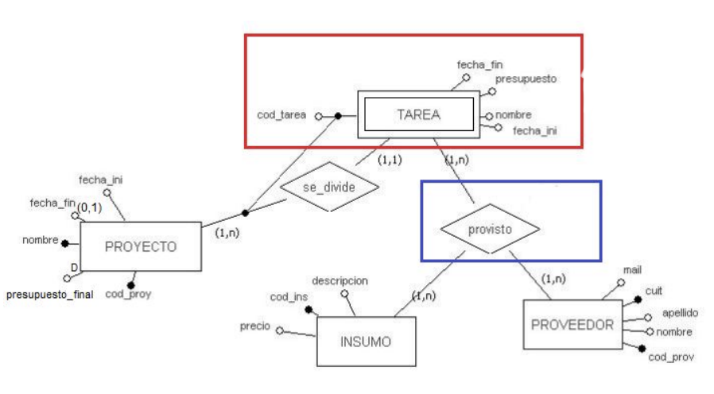

  |||
  | -- | -- |
  | **proyecto** (idproy, cod_proy, nombre, fecha_ini, fecha_fin, presupuesto_final)  | PK(idproy) CS(idproy) CK(cod_proy) CK(nombre) fecha_fin permite nulos |
  | ***tarea (idtarea, cod_tarea, nombre, fecha_ini, fecha_fin, presupuesto, proy)*** | ***PK(idtarea) CS(idtarea) CK(cod_tarea + proy) FK(proy, proyecto)*** |

## Transformación de Relaciones Recursivas 1:N

  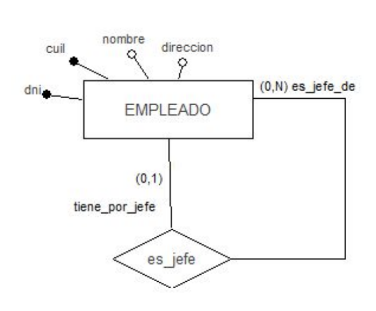

  |||
  | -- | -- |
  | **empleado** (idemp, dni, cuil, nombre, dirección, depto) | PK(idemp) CS(idemp) CK(dni) CK(cuil) FK(depto, departamento) |
  | ***es_jefe (emp, jefe)***                                 | ***PK(emp) emp no es autoincremental, es entera, única y no nula FK(emp, empleado) FK(jefe, empleado)*** |

## Transformación de Relaciones Recursivas N:N

  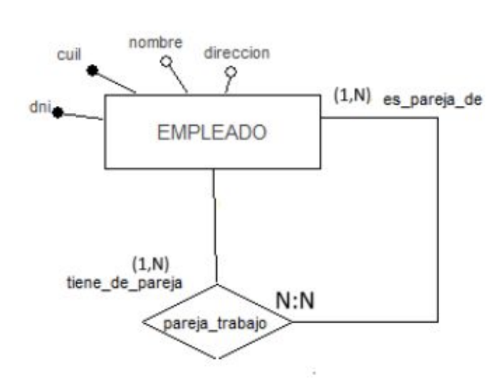

  |||
  | -- | -- |
  | **empleado** (idemp, dni, cuil, nombre, dirección, depto) | PK(idemp) CS(idemp) CK (dni) CK(cuil) FK(depto, departamento) |
  | ***pareja_trabajo (idpareja, emp1, emp2)***               | ***PK(idpareja) CS(idpareja) CK(emp1 + emp2) FK(emp1, empleado) FK(emp2, empleado)*** |

## Transformación de Jerarquías. Caso en que dejamos todo y hacemos explícita la relación ES_UN

  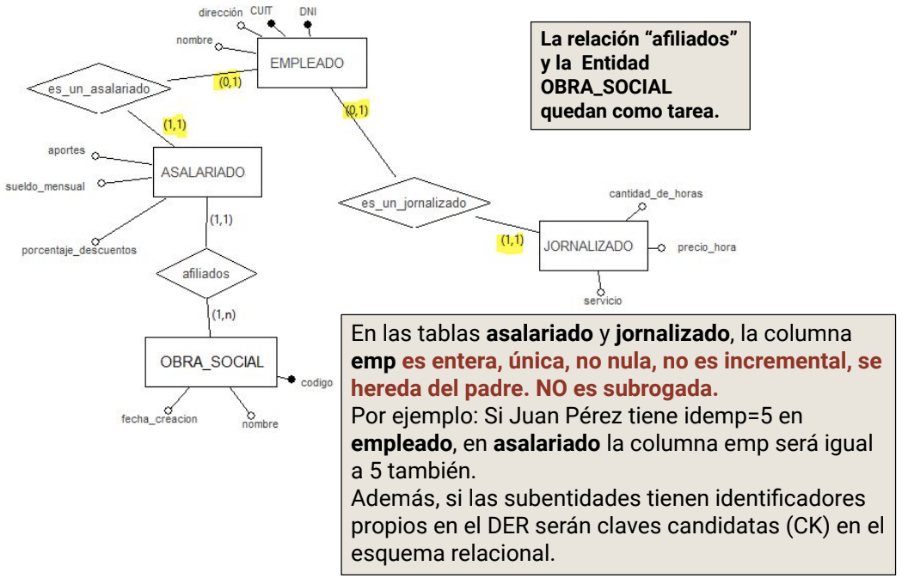

  |||
  | -- | -- |
  | **empleado** (idemp, dni, cuil, nombre, dirección, depto)            | PK(idemp) CS(idemp) CK(dni) CK(cuil) FK(depto, departamento) |
  | **asalariado** (emp, porcentaje_descuentos, sueldo_mensual, aportes) | PK(emp) emp es entera, única y no nula. No es autoincremental (no es subrogada) FK(emp, empleado) |
  | **jornalizado** (emp, cantidad_de_horas, precio_hora, servicio)      | PK(emp) emp es entera, única y no nula. No es autoincremental (no es subrogada) FK(emp, empleado) |

## Transformación de Relaciones Ternarias

  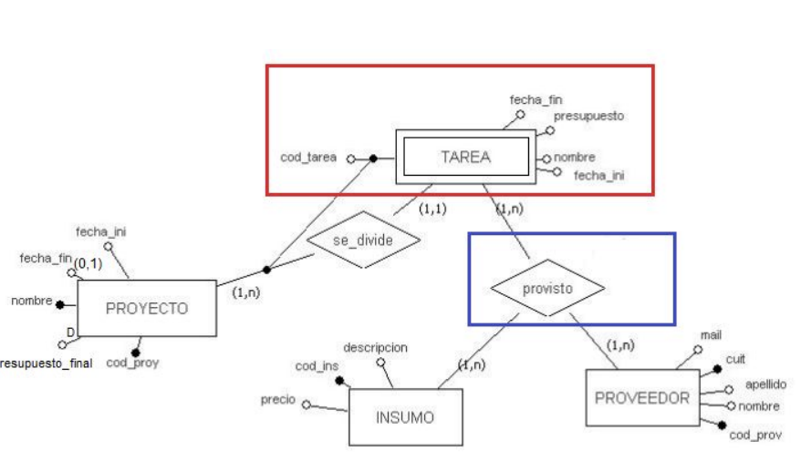

  |||
  | -- | -- |
  | **insumo** (idinsumo, cod_ins, descripcion, precio)                             | PK(idinsumo)    CS(idinsumo)    CK(cod_ins) |
  | **proveedor** (idproveedor, cod_prov, cuit, nombre, apellido, mail)             | PK(idproveedor) CS(idproveedor) CK(cod_prov) CK(cuit) |
  | **tarea** (idtarea, cod_tarea, nombre, fecha_ini, fecha_fin, presupuesto, proy) | PK(idtarea)     CS(idtarea)     CK(cod_tarea + proy)   FK(proy, proyecto) |
  | **provisto** (idprovisto, tar, prov, insum)                                     | PK(idprovisto)  CS(idprovisto)  CK(tar + prov + insum) FK(tar, tarea) FK(prov, proveedor) FK(insum, insumo) |

## Transformación de Historial en Relaciones

  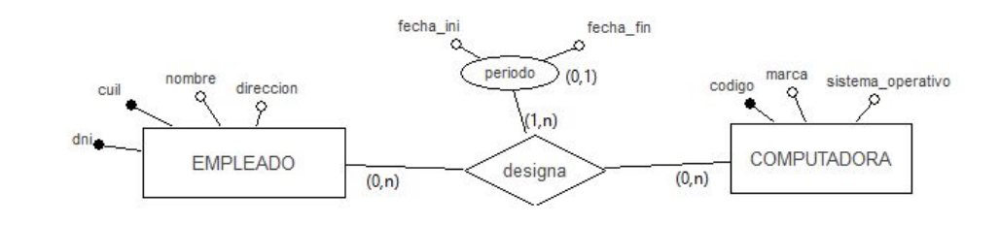

  |||
  | -- | -- |
  | **empleado** (idemp, dni, cuil, nombre, dirección, depto)  | PK(idemp)  CS(idemp)  CK(dni) CK(cuil) FK(depto, departamento) |
  | **computadora** (idcomp, codigo, marca, sistema_operativo) | PK(idcomp) CS(idcomp) CK(codigo)                               |
  | **designa** (iddesigna, emp, comp, fecha_ini, fecha_fin)   | ***PK (iddesigna) CS(iddesigna) CK(emp + comp + fecha_ini) FK(emp, empleado) FK(comp, computadora) fecha_fin permite nulos*** |
