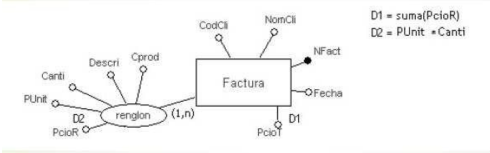

# Normalización

* El objetivo de cualquier metodología de diseño de BD es:
  * Evitar Anomalías de Almacenamiento
  * Reducir el costo de Mantenimiento, al tener un esquema flexible y permeable a los cambios
  * Tener independencia lógica y física de los datos

* **Diseño de BD** es agrupar los atributos en relaciones de modo que se minimice la redundancia de los datos
* Las actualizaciones de los datos almacenados en la BD pueden llevarse a cabo con un número mínimo de operaciones, reduciendo las posibilidades de que aparezcan incoherencias en los datos almacenados
* Reduce el espacio de almacenamiento de archivos requerido por las relaciones

## Objetivo

* Crear una representación precisa de los **datos**, de las **relaciones** y de las **restricciones**

## Las características de un conjunto adecuado de relaciones incluyen

* El **número mínimo de atributos** necesario para soportar los requisitos de datos de la organización
* Los **atributos con una relación lógica fuerte** (lo que se describe como dependencia funcional) se encuentran **en la misma relación**
* **Redundancia mínima**, estando cada atributo representado una sola vez, con la importante **excepción** de aquellos atributos que constituyan o formen parte de **claves foráneas**, los cuales son esenciales para la combinación de relaciones

## Definición

* Es una técnica para diseñar la estructura lógica de los datos de un sistema de información en el modelo relacional, desarrollada por E. F. Codd en 1972
* También es usado para validar si el MR obtenido es correcto
* Se aplica al MR una serie de **reglas** (Formas Normales) conocidas como **Proceso de Normalización** que permiten eliminar las dependencias no deseadas entre los atributos

## Redundancia de datos

* Las tablas con datos redundantes pueden presentar problemas que se denominan **anomalías de almacenamiento** (o actualización)
* El objetivo del proceso de normalización es **reducir** la **redundancia** de información

  | Tipos ||
  | -- | -- |
  | **Deseada**    | una tabla surgida como consecuencia de una relación N:N en el modelo conceptual, tendrá como clave candidata compuesta (o primaria) las dos claves primarias de las tablas que se relacionan, esto genera una redundancia. Un campo calculado también repite información |
  | **No deseada** | generan **anomalías** en la inserción, el borrado o la modificación de los datos |

## Ejemplo de anomalías de almacenamiento

* Tabla con datos de la facturación de artículos, donde todos sus campos son **NOT NULL**

  

* Anomalías de inserción:
  * Si quisiéramos **agregar un cliente nuevo**, p.e. (5, Juan Alvarez), al que no le hemos emitido aún ninguna factura, no podríamos, porque necesitamos facturarle algo para ingresarlo a la tabla
  * Si quisiéramos **agregar un producto nuevo**, el cuál no ha sido vendido aún, p.e (45, Limones), no podríamos, porque necesitamos facturar limones para poder ingresarlo a la tabla

* Anomalías de modificación:
  * Al tener que repetir fecha, CodCli, NomCli en cada renglón de la factura emitida, es factible cometer errores
  * Al tener que escribir la descripción del producto en cada factura en la cual se vendió, es factible cometer errores

* Anomalías de borrado:
  * Si queremos eliminar la Factura Nro. 3, borraremos también al cliente "Marta González" porque es la única vez que le facturamos
  * Si queremos borrar el tercer renglón de la Factura Nro. 2, borraremos también el producto "Tomates", porque es la única vez que lo facturamos

## Con este esquema se producen varias anomalías

* Estos errores surgen de no haber realizado un correcto modelo conceptual y su transformación al MR. Supongamos que esta tabla surgió del siguiente esquema conceptual:

  

* ¿Cuáles son los errores que se cometieron en este esquema?
  * Una forma de evitar este tipo de problemas consiste en seguir un riguroso diseño conceptual y una transformación de éste al MR (diseño
lógico)
  * Ante posibles dudas respecto a si un esquema relacional está correcto o no, aplicamos a dicho esquema un método formal de análisis que permita analizar errores y generar esquemas correctos. Este es el **proceso de normalización**

## Proceso de normalización

* Para validar si un esquema relacional está correctamente diseñado y no va a provocar anomalías, le vamos a pedir que se encuentre en BCFN o como mínimo en 3FN
* Consiste en aplicar una serie de **reglas** para eliminar redundancias e inconsistencias en las tablas
* Se traduce en la aplicación de las **Formas Normales**, que son un conjunto de restricciones sobre las tablas que evitan los problemas de redundancia y anomalías de modificación, inserción y borrado de datos

## Formas Normales

* Existen seis formas normales
* Las tres primeras reglas de normalización fueron perfiladas por el Dr. E.F.Codd en 1972
* Posteriormente, y como consecuencia de unas anomalías detectadas al utilizar las tres primeras formas normales, Boyce ayudó a Codd a redefinir la tercera forma normal, lo que se conoce como la forma normal de **Boyce-Codd**
* Más tarde Ronald Fagin introdujo la cuarta y quinta forma normal en un intento de mejorar el rendimiento de grandes sistemas transaccionales de las BD modernas

## Dependencia funcional (DF)

* Una tabla del MR se compone de un conjunto de atributos y dependencias: R (A, DF)
* A los atributos (A) sabemos cómo identificarlos
* ¿Cómo sabemos cuáles son las DF y cómo las identificamos?
* La **DF** describe la relación entre atributos en una relación
* La DF **es una propiedad de la semántica** o del significado de los atributos en una relación y no pueden obtenerse de manera automática en una relación determinada
* La semántica indica cómo se relacionan los atributos unos con otros, y específica las DFs entre los mismos
* Cuando una DF está presente se especifica como **una regla entre atributos**
* La DF puede ser utilizada para identificar la clave primaria de una relación

* Si X, Y son atributos de una relación R, Y es funcionalmente dependiente de X, o X determina a Y, si cada valor de X está relacionado con un solo valor de Y
* Se denota X -> Y
* X: determinante
* Y:  dependiente

* Si una restricción en R dice que no puede haber más de una tupla con el mismo valor para X en R (convirtiendo a X en PK) entonces: X -> Y para cualquier Y de R

### Ejemplo 1

* **Departamento** (nrodepto, nombre, #empleados) con PK(nroDepto)
  * nrodepto -> nombre
  * nrodepto -> #empleados
  * **¿nombre -> #empleados?**   dependerá de si nombre es CK o no

### Ejemplo 2

* **Empleado** (nroemp, nombre, dni, sexo) con PK(nroemp) y CK(dni)
  * nroemp -> nombre
  * nroemp -> dni
  * nroemp -> sexo
  * **¿dni -> nroemp?**         dni determina a nroemp, porque dado un dni hay un solo nroemp posible

### DF completa (DFC)

* Se dice que el atributo Y de R depende funcionalmente por completo del atributo X de R, si depende funcionalmente de X y no depende funcionalmente de ningún subconjunto de X
* Ejemplo:

  |||
  | -- | -- |
  | PROYECTO (COD_PROYECTO, DNI_EMPLEADO, FECHA_INCORPORACION, HORAS_DEDICADAS, NOMBRE_EMPLEADO, NOMBRE_PROYECTO) | PK(COD_PROYECTO + DNI_EMPLEADO) |
  |||
  | COD_PROYECTO , DNI_EMPLEADO -> FECHA_INCORPORACION ||
  | COD_PROYECTO , DNI_EMPLEADO -> HORAS_DEDICADAS ||

* Tienen DFC respecto de COD_PROYECTO y DNI_EMPLEADO
* También:

  ||
  | -- |
  | DNI_EMPLEADO , COD_PROYECTO -> NOMBRE_EMPLEADO |
  | DNI_EMPLEADO -> NOMBRE_EMPLEADO |

* Con lo cual, tenemos una **dependencia parcial** del nombre del empleado con el DNI. Dado sólo el DNI, podemos saber el
nombre del empleado, sin necesitar el código del proyecto para saberlo

### DF Parcial (DFP)

* X -> Y  tiene DFP si existe algún atributo que puede eliminarse de X y la DF se continúa verificando. Es decir:
  * Parte de la Clave (compuesta) -> Atributo No Clave
* Ejemplo:

  |||
  | -- | -- |
  | PROYECTO (COD_PROYECTO, DNI_EMPLEADO, FECHA_INCORPORACION, HORAS_DEDICADAS, NOMBRE_EMPLEADO, NOMBRE_PROYECTO) | PK(COD_PROYECTO + DNI_EMPLEADO) |
  |||
  | DNI_EMPLEADO -> NOMBRE_EMPLEADO | |
  | COD_PROYECTO -> NOMBRE_PROYECTO | |

### DF Transitiva (DFT)

* Una condición en la que X, Y y Z son atributos de una relación tales que: X -> Y e Y -> Z, entonces Z depende transitivamente de X a través
de Y ( X -> Z )
* Es decir: Atributo No Clave -> Atributo No Clave
* Ejemplo 1:

  |||
  | -- | -- |
  | ALUMNO (COD_ALUMNO, GRUPO, AULA) | PK(COD_ALUMNO) |
  |||
  | COD_ALUMNO -> GRUPO, AULA ||
  | GRUPO -> AULA ||

* Ejemplo 2:

  |||
  | -- | -- |
  | EMPLEADO (nro_empleado, nombre, posición, salario, nro_depto, nombre_depto) | PK(nro_empleado) |
  |||
  | nro_empleado -> nombre, posición, salario, nro_depto, nombre_depto ||
  | nro_depto -> nombre_depto ||

## 1FN

* Una relación R está en 1FN si los atributos sólo contienen valores atómicos (no son polivalentes, ni compuestos)
* Ejemplo:

  | No está en 1FN | 1FN |
  | -- | -- |
  | **PERSONAS** (DNI, nombre, sexo, titulos (descripcion_titulo_1, ... , descripcion_titulo_n )) | **PERSONAS** (DNI, nombre, sexo) |
  |                                                                                               | **TITULOS** (DNI, descripcion_titulo) |

## 2FN

* Se basa en el concepto de dependencia funcional total
* Un esquema de relación R está en **2FN**, sí y sólo si, está en 1FN y todo atributo no clave en R depende funcionalmente de manera
total de la clave primaria de R
* Un atributo No clave no debe depender parcialmente de la clave
* **Se crea una tabla para cada dependencia parcial**
* Ejemplo:

  | No está en 2FN | 2FN |
  | -- | -- |
  | **ALQUILER** (#cliente, #propietario, nombre_cliente, nombre_propietario, monto, fecha_inicio, duracion) PK (#cliente + #propietario) | **ALQUILER** (#cliente, #propietario, monto, fecha_inicio, duracion) PK(#cliente + #propietario) |
  | DF : #cliente, #propietario -> nombre_cliente, nombre_propietario, monto, fecha_inicio, duracion  | |
  | DFP: #cliente -> nombre_cliente          | **CLIENTES** (#cliente, nombre_cliente) PK(#cliente) |
  | DFP: #propietario -> nombre_propietario  | **PROPIETARIOS** (#propietario, nombre_propietario) PK(#propietario) |

## 3FN

* Un esquema de relación R está en **3FN** si está en 2FN y ningún atributo no primo (que no es parte de la clave primaria) de R depende
transitivamente de la clave primaria
* Se ocupa de eliminar de una tabla las dependencias transitivas. Es decir, eliminar los atributos no claves que no dependen de la clave primaria, sino de otro atributo no clave
* Recordamos: una **dependencia transitiva** es un tipo de dependencia funcional en la que el valor de un atributo o campo no clave viene determinado por el valor de otro campo que tampoco es clave
* **La dependencia transitiva se pasa a otra tabla**
* Ejemplo:

  | No está en 3FN | 3FN |
  | -- | -- |
  | **EMPLEADO** (nro_empleado, nombre, posición, salario, nro_depto, nombre_depto) PK(nro_empleado) | **EMPLEADO** (nro_empleado, nombre, posición, salario, nro_depto) PK(nro_empleado) FK(nro_depto, DEPARTAMENTO) |
  | nro_empleado -> nombre, posición, salario, nro_depto, nombre_depto | |
  | nro_depto -> nombre_depto | **DEPARTAMENTO** (nro_depto, nombre_depto) PK(nro_depto) |
  | **nombre_depto depende transitoriamente de la PK** ||

## FNBC

* Un esquema de relación está en **FNBC** si y sólo si todo "determinante" es una clave candidata
* Ejemplo:

| No está en FNBC | |
| -- | -- |
| **ENTREVISTAS** (#cliente, fecha_entrevista, hora_entrevista, lugar_entrevista, empleado) PK(#cliente + fecha_entrevista) ||
| DF de la PK: #cliente, fecha_entrevista -> hora_entrevista, lugar_entrevista, empleado | |
| DF de la CK: empleado, fecha_entrevista, hora_entrevista -> #cliente, lugar_entrevista | |
| DF de la CK: lugar_entrevista, fecha_entrevista, hora_entrevista -> #cliente, empleado | |
| DF: empleado, fecha_entrevista -> lugar_entrevista | |

## Tener en  cuenta

* Toda relación que está en FNBC está en 3FN
* La mayoría de las relaciones que están en 3FN, también están en FNBC, pero no necesariamente
* Es mejor tener los diseños en FNBC, pero si no se puede, entonces se dejan en 3FN
* 2FN y 1FN no se consideran buenos diseños
