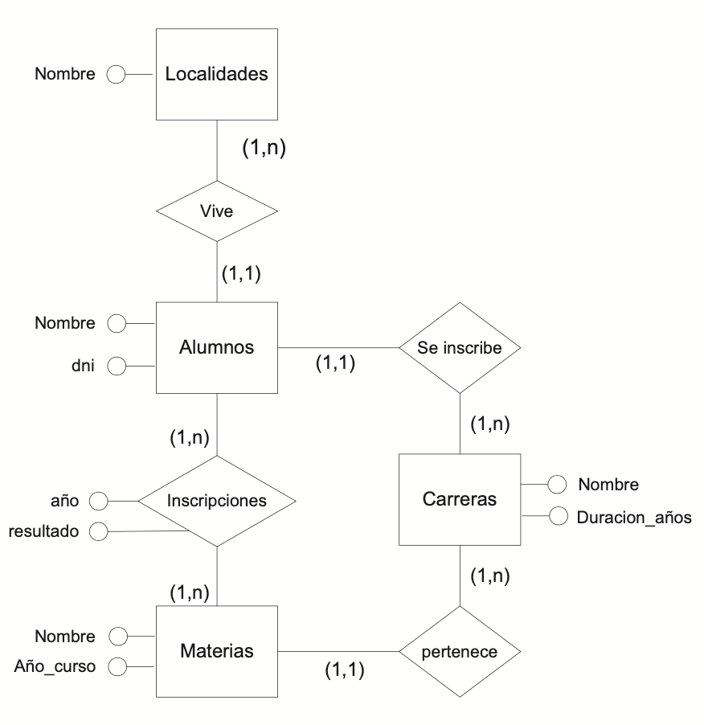
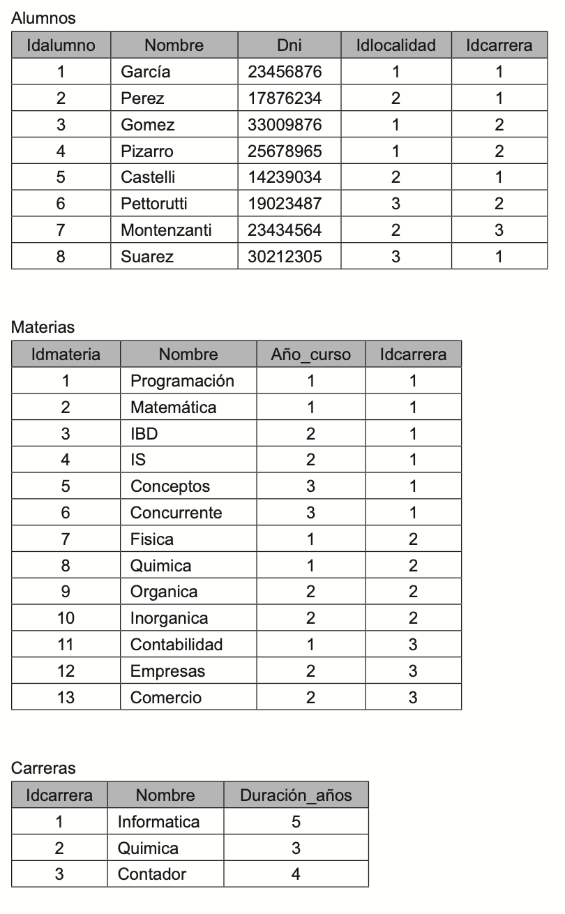
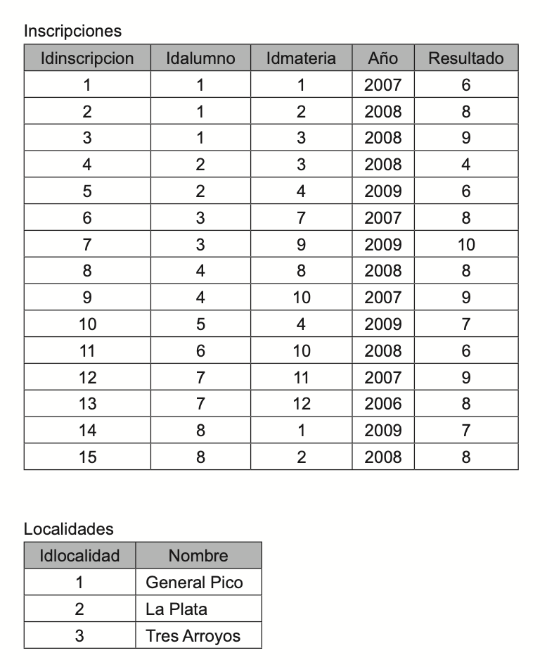

# Modelo Físico

## Structured Query Language (SQL)

* Lenguaje para **definición** y **manipulación** de datos
* Desarrollado inicialmente en laboratorios de investigación de IBM
* Estándar desde 1986
* Es **declarativo**: se indica **qué datos** se requieren, sin especificar cómo
* Hay **independencia física** de los datos

  |||||
  | -- | -- | -- | -- |
  | **DDL** | **Lenguaje de Definición de Datos** | permite crear y modificar el esquema de la base, tablas, restricciones, vistas, etc. | CREATE, ALTER, DROP |
  | **DML** | **Lenguaje de Manejo de Datos**     | permite actualizar datos (inserción, modificación, eliminación) | INSERT, UPDATE, DELETE |
  | **DQL** | **Lenguaje de Consulta de Datos**   | permite consultar (seleccionar) datos | SELECT |
  | **DCL** | **Lenguaje de Control de Datos**    | permite gestionar el acceso a los datos | GRANT, REVOKE |
  | **TCL** | **Lenguaje de Control de Transacciones** | permite ejecutar varios comandos de forma simultánea como si fuera un comando atómico o indivisible | COMMIT, ROLLBACK |

## Buenas prácticas del SQL

* Las sentencias de SQL se pueden escribir tanto en mayúsculas como en minúsculas y lo mismo sucede con los nombres de las tablas y de las columnas, o cualquier objeto
* Una buena práctica es usar **mayúsculas** para las **palabras clave del lenguaje** y **minúsculas** para los **nombres de los objetos**, con notación **snake_case**
* Las **sentencias** de SQL **terminan** siempre con el **carácter punto y coma** (;)

## DDL

### Crear o borrar una BD

| Sentencia SQL ||
| -- | -- |
| ```CREATE DATABASE nombre_bd;``` | genera una BD cuyo nombre se indica |
| ```DROP DATABASE nombre_bd;```   | elimina una BD completa (tablas y datos) |

### Operar contra Tablas de BD

| Sentencia SQL ||
| -- | -- |
| ```CREATE TABLE nombre_tabla (...);``` | genera una tabla en una BD |
| ```DROP TABLE nombre_tabla;```         | elimina una tabla del modelo |
| ```ALTER TABLE nombre_tabla (...);```  | modifica una tabla del modelo |

### Ejemplo creación tabla empresas

```sql
CREATE TABLE empresas (
  idempresa INTEGER UNSIGNED NOT NULL AUTO_INCREMENT, 
  empresa VARCHAR(100) NOT NULL,
  abreviatura VARCHAR(10) NULL,
  cuit VARCHAR(13) NULL,
  direccion VARCHAR(100) NULL,
  observaciones TEXT NULL,
  PRIMARY KEY(idempresa),
  UNIQUE INDEX empresas_index19108(empresa));
```

### Ejemplo creación tabla pacientesempresas

```sql
CREATE TABLE pacientesempresas (
  idpacienteempresa INTEGER UNSIGNED NOT NULL AUTO_INCREMENT,
  idpaciente_os INTEGER UNSIGNED NOT NULL,
  idempresa INTEGER UNSIGNED NOT NULL,
  fecha_desde DATE NOT NULL,
  fecha_hasta DATE NULL,
  PRIMARY KEY(idpacienteempresa),
  INDEX empleadosempresas_FKIndex1(idempresa),
  INDEX pacientesempresas_FKIndex2(idpaciente_os),
  FOREIGN KEY(idempresa)
    REFERENCES empresas(idempresa)
      ON DELETE RESTRICT
      ON UPDATE NO ACTION,
  FOREIGN KEY(idpaciente_os)
    REFERENCES pacientes_os(idpaciente_os)
      ON DELETE RESTRICT
      ON UPDATE NO ACTION);
```

### Ejemplo modificación tabla empresas

```sql
ALTER TABLE empresas (
  Add column razon_social VARCHAR(100) NOT NULL,
  Drop column cuit,
  Alter column direccion VARCHAR(50) NULL);
```

## DML

### Insertar tuplas a la BD

```sql
INSERT INTO alumnos (nombre, dni, idlocalidad, idcarrera)
VALUES ('Julio Cesar', '12344321', 3, 1);
```

### Borrar tuplas de la BD

```sql
DELETE FROM alumnos
WHERE idlocalidad = (SELECT idlocalidad
                     FROM localidades
                     WHERE nombre = 'La Plata');
```

### Modificar tuplas de la BD

```sql
UPDATE carreras
SET duración_años = 5
WHERE nombre = "Contador";
```

## DQL

### Estructura básica

```sql
SELECT lista_de_columnas
FROM lista_de_tablas
[WHERE predicado];
```

### Ejemplo modelos



| | |
| -- | -- |
| **ALUMNOS** (idalumno, nombre, dni, idlocalidad, idcarrera)            | PK(idalumno) |
| **MATERIAS** (idmateria, nombre, año_curso, idcarrera)                 | PK(idmateria) |
| **CARRERA** (idcarrera, nombre, duración_años)                         | PK(idcarrera) |
| **INSCRIPCIONES** (idinscripcion, idalumno, idmateria, año, resultado) | PK(idinscripciones) |
| **LOCALIDADES** (idlocalidad, nombre)                                  | PK(idlocalidad) |

### Ejemplo estado de la BD en un momento particular




### Ejemplo 1: presentar todos los alumnos que figuran en la tabla Alumnos

```sql
SELECT nombre
FROM alumnos;
```

| nombre |
| -- |
| García |
| Perez  |
| Gomez  |
| Pizarro |
| Castelli |
| Pettorutti |
| Montenzanti |
| Suarez |

### Ejemplo 2: presentar todos los datos de los alumnos que figuran en la tabla alumnos

```sql
SELECT idalumno, nombre, dni, idlocalidad, idcarrera 
FROM alumnos;
```

o mediante operador *

```sql
SELECT *
FROM alumnos;
```

### Ejemplo 3: presentar todos los alumnos que cursen la carrera cuyo código es 2

```sql
SELECT nombre
FROM alumnos
WHERE idcarrera = 2;
```

| nombre |
| -- |
| Gomez  |
| Pizarro |
| Pettorutti |

### Ejemplo 4: presentar todos los alumnos que cursen la carrera cuyo código es 2 y vivan en la localidad con código 1

```sql
SELECT nombre
FROM alumnos
WHERE idcarrera = 2 AND idlocalidad = 1;
```

| nombre |
| -- |
| Gomez  |
| Pizarro |

### Ejemplo 5: presentar todas las materias y el año en que se cursan

```sql
SELECT nombre, año_curso
FROM materias;
```

| nombre | año_curso |
| -- | -- |
| Programación | 1 |
| Matemática   | 1 |
| IBD          | 2 |
| IS           | 2 |
| Conceptos    | 3 |
| Concurrente  | 3 |
| Fisica       | 1 |
| Quimica      | 1 |
| Organica     | 2 |
| Inorganica   | 2 |
| Contabilidad | 1 |
| Empresas     | 2 |
| Comercio     | 2 |

### Ejemplo 6: mostrar todos los códigos de materias que estén en la tabla Inscripciones que tengan al menos a un alumno aprobado

```sql
SELECT idmateria
FROM inscripciones
WHERE resultado > 3;
```

| Idmateria |
| -- |
| 1 |
| 2 |
| 3 |
| 3 |
| 4 |
| 7 |
| 9 |
| 8 |
| 10 |
| 4 |
| 10 |
| 11 |
| 12 |
| 1 |
| 2 |

Para eliminar tuplas repetidas se debe utilizar la cláusula DISTINCT

```sql
SELECT DISTINCT idmateria
FROM inscripciones
WHERE resultado > 3;
```

### Ejemplo 7: presentar todas las carreras que tiene entre 4 y 6 años de duración

```sql
SELECT nombre
FROM carreras
WHERE duracion_años >= 4 AND duracion_años <= 6;
```

Es posible realizar la misma consulta utilizando el operador BETWEEN

```sql
SELECT nombre
FROM carreras
WHERE duracion_años BETWEEN 4 AND 6;
```

Los atributos utilizados en el SELECT de una consulta SQL pueden tener asociados operaciones válidas para sus dominios. Así, por ejemplo sería válida una consulta que devuelva el salario de un empleado menos un 10% de retención

```sql
SELECT nombre_empleado, salario * 0.9
FROM empleados
WHERE ocupacion = "Gerente";
```

### Ejemplo 8: presentar el nombre de todos los alumnos y la carrera que cursa

```sql
SELECT alu.nombre, carr.nombre
FROM alumnos alu, carreras carr
WHERE alu.idcarrera = carr.idcarrera;
```

| alu.nombre | carr.nombre |
| -- | -- |
| García     | Informática |
| Perez      | Informática |
| Gomez      | Química     |
| Pizarro    | Química     |
| Castelli   | Informática |
| Pettorutti | Química     |
| Montezanti | Contador    |
| Suarez     | Informática |

### Ejemplo 9: presentar el nombre de todos los alumnos, la carrera que cursa y de que localidad proviene

```sql
SELECT a.nombre AS nombrealumno, c.nombre AS nombrecarrera, l.nombre AS nombrelocalidad
FROM alumnos a, carreras c, localidades l
WHERE a.idcarrera = c.idcarrera 
AND a.idlocalidad = l.idlocalidad;
```

| nombrealumno | nombrecarrera | nombrelocalidad |
| -- | -- | -- |
| García     | Informática | General Pico |
| Perez      | Informática | La Plata     |
| Gomez      | Química     | General Pico |
| Pizarro    | Química     | General Pico |
| Castelli   | Informática | La Plata     |
| Pettorutti | Química     | Tres Arroyos |
| Montezanti | Contador    | La Plata     |
| Suarez     | Informática | Tres Arroyos |

### Ejemplo 10: presentar todas las materias aprobadas del alumno Pizarro, o rendidas durante el 2008

```sql
(SELECT m.nombre
FROM alumnos a, materias m, inscripciones i
WHERE a.nombre = "Pizarro"
AND a.idmateria = i.idmateria
AND i.idalumno = a.idalumno
AND i.resultado > 3)
UNION
(SELECT m.nombre
FROM alumnos a, materias m, inscripciones i
WHERE a.nombre = "Pizarro"
AND a.idmateria = i.idmateria
AND i.idalumno = a.idalumno
AND i.año = 2008);
```

Para la diferencia de conjuntos es EXCEPT
Para la intersección de conjuntos es INTERSECT

### Ejemplo 11: presentar todas las materias que contengan el substring "ga" dentro de su nombre

```sql
SELECT nombre
FROM materias
WHERE nombre LIKE "%ga%";
```

| nombre |
| -- |
| Organica   |
| Inorganica |

### Ejemplo 12: presentar el nombre de los alumnos que tengan DNI que comiencen con 23 millones

```sql
SELECT nombre
FROM alumnos
WHERE nombre LIKE "23 _ _ _ _ _ _";
```

### Ejemplo 13: presentar los nombres de todas las materias y el año de curso, para la carrera informática, ordenados por año de curso

```sql
SELECT m.nombre, m.año_curso
FROM materias m, carreras c
WHERE c.nombre = "Informática"
AND m.idcarrera = c.idcarrera
ORDER BY m.año_curso;
```

| m.nombre | m.año_curso |
| -- | -- |
| Programación | 1 |
| Matermática  | 1 |
| IBD          | 2 |
| IS           | 2 |
| Conceptos    | 3 |
| Concurrente  | 3 |

Por defecto la cláusula ORDER BY ordena las tuplas de menor a mayor

### Ejemplo 14: presentar los nombres de todas las materias y el año de curso, para la carrera informática, ordenados por año de curso de mayor a menor

```sql
SELECT m.nombre, m.año_curso
FROM materias m, carreras c
WHERE c.nombre = "Informática"
AND m.idcarrera = c.idcarrera
ORDER BY m.año_curso DESC;
```

| m.nombre | m.año_curso |
| -- | -- |
| Conceptos    | 3 |
| Concurrente  | 3 |
| IBD          | 2 |
| IS           | 2 |
| Programación | 1 |
| Matermática  | 1 |

### Ejemplo 15: presentar los nombres de todas las materias y el año de curso, para la carrera informática, ordenados por año de curso y nombre de la materia

```sql
SELECT m.nombre, m.año_curso
FROM materias m, carreras c
WHERE c.nombre = "Informática"
AND m.idcarrera = c.idcarrera
ORDER BY m.año_curso, m.nombre;
```

| m.nombre | m.año_curso |
| -- | -- |
| Matermática  | 1 |
| Programación | 1 |
| IBD          | 2 |
| IS           | 2 |
| Conceptos    | 3 |
| Concurrente  | 3 |

### Ejemplo 16: retornar el nombre del alumno que aparece primero en una lista alfabética

```sql
SELECT MIN(nombre)
FROM alumnos;
```

### Ejemplo 17: retornar la máxima nota de alguna materia durante 2008

```sql
SELECT MAX(resultado)
FROM inscripciones
WHERE año = 2008;
```

### Ejemplo 18: informar cuantos alumnos aprobaron el final de programación

```sql
SELECT COUNT(*)
FROM materias m, inscripciones i
WHERE i.idmateria = m.idmateria
AND m.nombre = "Programación"
AND i.resultado > 3;
```

### Ejemplo 19: informar cuantos alumnos aprobaron al menos un final durante 2008

```sql
SELECT COUNT(DISTINCT idalumno)
FROM inscripciones
WHERE resultado > 3
AND año = 2008;
```

### Ejemplo 20: informar la nota promedio (con y sin aplazos) del alumno Montezanti

```sql
SELECT AVG(resultado)
FROM inscripciones i, alumnos a
WHERE a.nombre = "Montesanti"
AND i.idalumno = a.idalumno;
```

### Ejemplo 21: retornar la carrera de mayor duración

```sql
SELECT nombre
FROM carreras
WHERE duración_años = (SELECT MAX(duración_años)
                       FROM carreras);
```

### Ejemplo 22: presentar para cada carrera la cantidad de materias que la componen, solo mostrar en el resultado aquellas carreras con más de 20 materias

```sql
SELECT c.nombre, COUNT(*)
FROM carreras c, materias m
WHERE c.idcarrera = m.idmateria
GROUP BY c.nombre
HAVING COUNT(*) > 20;
```

### Ejemplo 23: presentar para cada alumno el total de veces que rindió, siempre que el promedio de sus notas supere siete

```sql
SELECT a.nombre, COUNT(i.idmateria)
FROM alumnos a, inscripciones i
WHERE a.idalumno = i.idalumno
GROUP BY a.nombre
HAVING AVG(i.resultado) > 7;
```

### Ejemplo 24: informar el nombre de los alumnos que están inscriptos en carreras de 5 años de duración

```sql
SELECT nombre
FROM alumnos
WHERE idcarrera IN (SELECT idcarrera
                    FROM carreras
                    WHERE duración_años = 5);

```

### Ejemplo 25: mostrar las materias que no hayan sido aprobadas por ningún alumno

```sql
SELECT nombre
FROM materias
WHERE idmateria NOT IN (SELECT idmaterias
                        FROM inscripciones
                        WHERE resultado > 3);
```

### Ejemplo 26: mostrar el nombre de los alumnos que hayan aprobado algún final durante 2007

```sql
SELECT nombre
FROM alumnos
WHERE EXIST (SELECT *
             FROM inscripciones
             WHERE alumnos.idalumno = inscripciones.idalumno
             AND resultado > 3);
```

### Ejemplo 27: mostrar aquellos alumnos que no se inscribieron en ma- teria alguna

```sql
SELECT a.nombre
FROM alumnos a
WHERE NOT EXIST (SELECT *
                 FROM inscripciones i
                 WHERE a.idalumno = i.idalumno);
```

### Ejemplo 30: mostrar aquellos alumnos que hayan inscripto en todas las materias de la carrera

```sql
SELECT a.nombre
FROM alumnos a
WHERE NOT EXIST (SELECT *
                 FROM materia m
                 WHERE m.idcarrera = a.idcarrera 
                 AND NOT EXIST(SELECT *
                               FROM inscripciones i
                               WHERE i.idmateria = m.idmateria
                               AND i.idalumno=a.idalumno));
```

### Ejemplo 31: presentar todos los alumnos que no tengan defina una localidad de procedencia

```sql
SELECT nombre
FROM alumnos
WHERE idlocalidad IS NULL;
```
