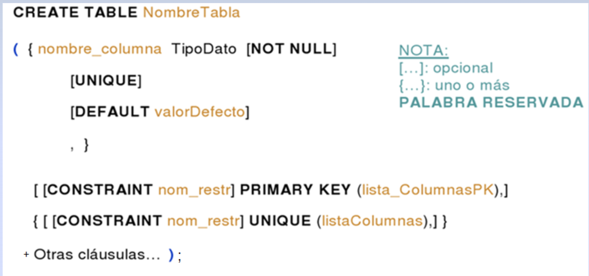
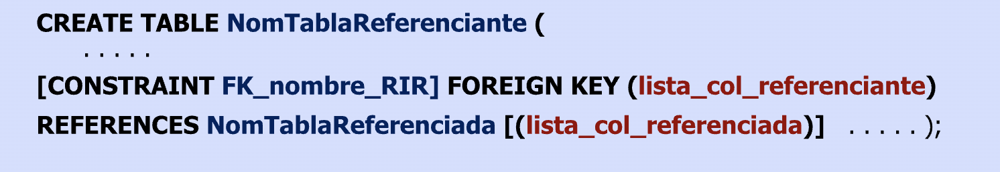

# Modelo Físico

## Structured Query Language (SQL)

* Lenguaje para **definición** y **manipulación** de datos
* Desarrollado inicialmente en laboratorios de investigación de IBM
* Estándar desde 1986
* Es **declarativo**: se indica **qué datos** se requieren, sin especificar cómo

  |||||
  | -- | -- | -- | -- |
  | **DDL** | **Lenguaje de Definición de Datos** | permite crear y modificar el esquema de la base, tablas, restricciones, vistas, etc. | CREATE, DROP, ALTER |
  | **DML** | **Lenguaje de Manejo de Datos**     | permite consultar (selección) y actualizar datos (inserción, modificación, eliminación) | SELECT, INSERT, DELETE, UPDATE |
  | **DCL** | **Lenguaje de Control de Datos**    | permite gestionar el acceso a los datos | GRANT, REVOKE |
  | **TCL** | **Lenguaje de Control de Transacciones** | permite ejecutar varios comandos de forma simultánea como si fuera un comando atómico o indivisible | COMMIT, ROLLBACK |

* Otras posibilidades:

  |||
  | -- | -- |
  | **SQL Procedural** | lenguaje de programación para escribir PSM (Persistent Stored Modules): triggers, funciones y stored procedures |
  | **SQL empotrado**  | manipulación de datos empotrada desde un lenguaje anfitrión |
  | **Lenguajes de 4º Generación (4GL)** | generadores de formularios, informes, gráficos |

* [SQL para SQLite](https://www.sqlite.org/lang.html)

## SQL para definición de datos

* Las **sentencias del DDL** se usan para definir la semántica del esquema relacional: tablas, posibles valores (dominios), asociaciones, restricciones y demás objetos
* El SGBD guarda esta información en tablas propias (metadatos)

  

* La definición de la clave primaria, alternativa, extranjera (y otras restricciones) puede hacerse en sentencia aparte alterando la definición de la tabla:

  

## Tipos de Datos

* El esquema de BD se completa con la definición de los dominios de cada uno de los atributos
* Los SGBD incluye un conjunto considerable de **tipos de datos básicos** que se adaptan a muchas aplicaciones
* Algunos de los tipos más utilizados:

  |||
  | -- | -- |
  | **integer**      | para números enteros |
  | **numeric**      | para números decimales |
  | **char/varchar** | para cadenas de caracteres de longitud fija / variable |
  | **date**         | para fechas |
  | **time**         | para horas del día |
  | **timestamp**    | para los valores que contienen fecha y hora |

* [Datatypes en SQLite](https://www.sqlite.org/datatype3.html)

## Restricciones de Integridad (RI) de unicidad y no-nulidad

  

* **Ante cualquier acción sobre la BD -> el SGBD cerifica el cumplimiento de todas las restricciones de integridad definidas**
* La clave de una relación R es un conjunto no vacío de atributos que identifican unívocamente cada tupla de R
* En una table sólo puede haber una restricción de clave primaria (PK) pero puede haber varias restricciones UNIQUE
* Una **PK no puede ser nula!**
* La restricción NOT NULL sobre un atributo provoca el rechazo de cualquier intento de colocar un nulo en esa columna

## Restricciones de Integridad Referencial (RIRs)

* El conjunto de valores de una **clave extranjera (FK) de una relación R** debe coincidir con el conjunto de valores de los atributos en una relación **R'** - que son clave (primaria o alternativa) - al que la FK hace referencia, o bien debe ser nulo (si se permite)

  

* En SQL se pueden especificar en la definición de la tabla (o del atributo, si es único):

  

* o mediante sentencias de alteración de la definición de la tabla:

  

## Ejemplo


## Tips útiles

* Agregar un prefijo a las tablas que indique a qué práctico/ejercicio corresponden. Ejemplo:

  ```sql
  CREATE TABLE TP1_EJ1_ARTICULO ...
  ```

* Dar nombres descriptivos a las restricciones y demás objetos del esquema y prefijarlos para identificarlos fácilmente:

  ```sql
  Clave Primaria:    PK_
  Clave Extranjera:  FK_
  Unique:      UQ_
  ```

## Eliminación de tablas

```sql
DROP TABLE NombreTabla [RESTRICT | CASCADE]
```

* Elimina la definición de la tabla (junto con las filas que contiene)
* Tener en cuenta:

  |||
  | -- | -- |
  | **RESTRICT** | se eliminará sólo so no se hace referencia a la tabla en ninguna RIR no hay objetos definidos a partir de ella -> ***es la opción por defecto en SQL*** |
  | **CASCADE**  | se eliminará la tabla junto con **todos** los objetos y restricciones asociados a la tabla (también los objetos que a su vez dependen de ellos) -> ***tener precaución en su uso*** |

## SQL para manipulación de datos


