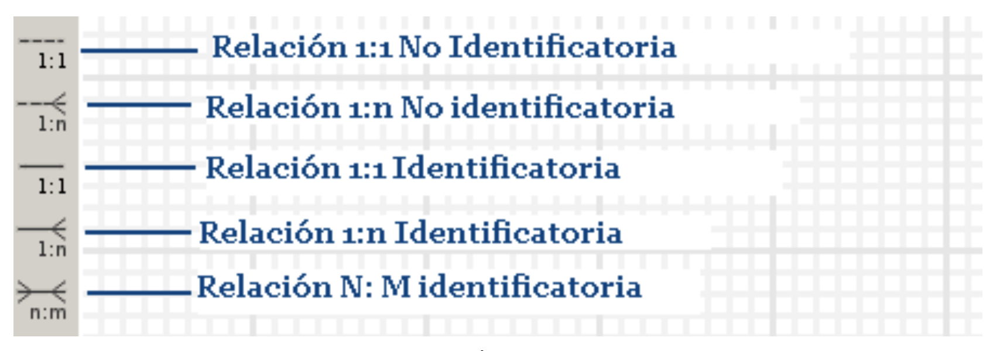
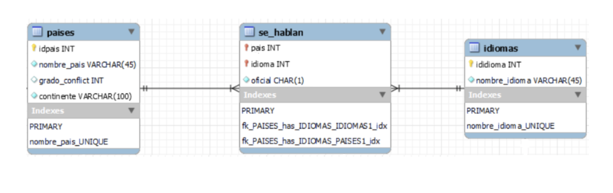

# MySQL WorkBench

* Es un entorno gráfico para el diseño y documentación de BD relacionales
* Versiones: open source y comercial
* Descarga: [https://dev.mysql.com/downloads/workbench](https://dev.mysql.com/downloads/workbench)
* Se utiliza para representar el DER de una BD, luego se crea el modelo físico en el SGBD MySQL Server 5.5 o versiones posteriores

## Esquema relacional

1. Se abre la aplicación
1. Se crea nuevo esquema relacional (File/New Model)
1. Clic sobre el ícono (+) y luego "Add Diagram"
1. Clic sobre el ícono Insertar Tabla
1. Botón derecho "Edit Table..."
    1. Crear columnas (nombre y tipo) y restricciones (PK, NN, UQ, AI, Default)
    1. PK subrogada (INT, PK, NN, UQ, AI)
    1. CK (tipo, NN, UQ)
    1. Atributo descriptores

## Relaciones entre las tablas

|||
| -- | -- |
| Relación 1:1 No identificatoria | propaga la PK de una tabla como FK a otra tabla. Se usa para relaciones con conectividad 1:1 |
| Relación 1:N No identificatoria | propaga la PK de una tabla como FK a otra tabla. Se usa para relaciones con conectividad 1:N |
| Relación 1:1 Identificatoria  | propaga la PK de una tabla como FK a otra tabla, pero además será PK no subrogada. Se usa para relaciones con conectividad 1:1 |
| Relación 1:N Identificatoria  | propaga la PK de una tabla como FK a otra tabla, pero además será PK no subrogada. Se usa para relaciones con conectividad 1:N |
| Relación N:M                  | crea una nueva tabla para las relaciones con conectividad N:M |

* Ejemplo: "En los países se hablan distintos idiomas y cada idioma se habla al menos en un país. Cada país tiene como mínimo un idioma oficial, se quieren saber tanto los idiomas oficiales como los no oficiales"

    

## Ingeniería hacia adelante

* Permite obtener el esquema físico de un esquema relacional de una BD en SGBD (Ej. MySQL Server)
* Menu DataBase / Forward Engineer...
* Next, Next, clic en Export MySQL Table Objects Next, Next, Close

## Visualizar el esquema físico de la BD

1. Ir al home de MySQL WorkBench
1. Clic en la instancia del servidor MySQL en donde se haya creado la BD, en este caso, solo se tiene la instancia local
